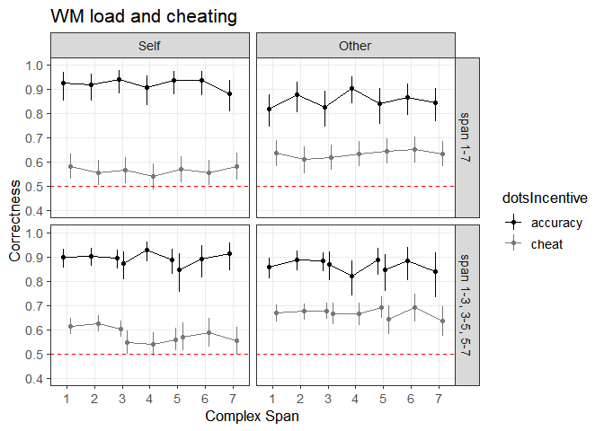
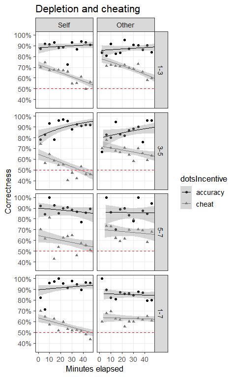
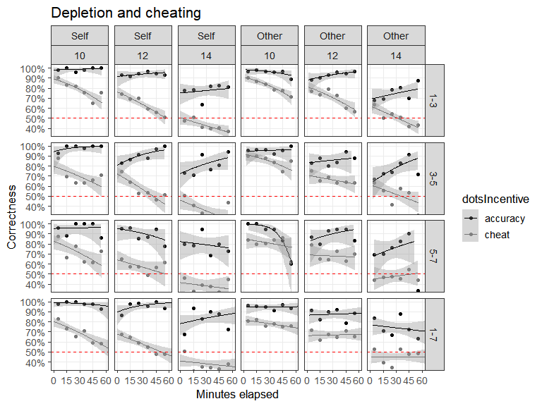
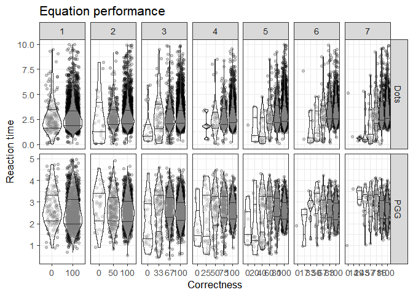

Morality in the time of cognitive famine - Dots task
================
Jonas Kristoffer Lindeløv
December, 2018

-   [About](#about)
-   [Setting up](#setting-up)
-   [Descriptives](#descriptives)
-   [WM Load and dots: Figure 4 and supplementary](#wm-load-and-dots-figure-4-and-supplementary)
-   [WM load and dots: inferential stuff](#wm-load-and-dots-inferential-stuff)
-   [Prepare for depletion analyses](#prepare-for-depletion-analyses)
-   [Depletion and dots: figure 5 and supplementary](#depletion-and-dots-figure-5-and-supplementary)
-   [Depletion analysis](#depletion-analysis)
-   [Supplementary stuff](#supplementary-stuff)
    -   [A validity check: Equation correctness and reaction time](#a-validity-check-equation-correctness-and-reaction-time)
    -   [Percieved load (questionnaire data)](#percieved-load-questionnaire-data)

About
=====

This is part of the analysis that accompanies the paper "Morality in the time of cognitive famine" by Panos, Jonas, Michaela, and others. You are now looking at the analysis of **experiment 3 and 4** using the Dots Task to study cheating.

Setting up
==========

Load appropriate stuff:

``` r
library(car)  # For some of the logistic regressions
library(tidyverse)
library(lme4)
library(kableExtra)

source('misc/functions utility.R')
source('misc/functions inference.R')  # Contains LRT and LRT_binom
```

You could redo the preprocessing of the original data if you wanted to. It saves the data.frames which are loaded in the sections below.

``` r
source('preprocess dots.R')
```

``` r
D_dots = readRDS('data/dots.Rda')
D_dots = droplevels(subset(D_dots, condition == 'experiment'))  # Not practice, etc
D_dots = select(D_dots, -encode, -equationCorrect, -equationScores, -equationRTs, -recallAns, -equationAnss)  # Tidyr doesn't like these matrix columns and we won't
D = D_dots  # For convenience
```

Descriptives
============

``` r
# Just one row per subject to do descriptives on them
D_id = D[!duplicated(D$id), ]

# Per-group descriptives for paper
D_id %>%
  group_by(exp) %>%
  summarise(n=n(),
            age_years = sprintf('%.1f (%.1f)', mean(age), sd(age)),
            males = sprintf('%i (%.1f %%)', sum(gender=='male'), 100*sum(gender=='male')/n())) #%>%
```

    ## # A tibble: 2 x 4
    ##     exp     n age_years  males      
    ##   <dbl> <int> <chr>      <chr>      
    ## 1     3    77 23.7 (2.8) 33 (42.9 %)
    ## 2     4   120 23.7 (3.9) 61 (50.8 %)

``` r
  #kable() %>% 
  #kable_styling(bootstrap_options = "striped", full_width = F)


# Supplementary table: stratified by level and stimType descriptives
x = D_id %>%  # Per-person
  group_by(stimType, level) %>%
  summarise(n=n(),
            males = sprintf('%i (%.1f %%)', sum(gender=='male'), 100*sum(gender=='male')/n()),
            age_years = sprintf('%.1f (%.1f)', mean(age), sd(age)))

y = D %>%  # All trials
  group_by(stimType, level) %>%
  summarise(arithmetic = sprintf('%.1f%%', mean(equationCorrectness)*100),
            recall = sprintf('%.1f%%', mean(recallProportion)*100))

bind_cols(x, y[,3:4]) #%>%
```

    ## # A tibble: 8 x 7
    ## # Groups:   stimType [?]
    ##   stimType level     n males       age_years  arithmetic recall
    ##   <fct>    <fct> <int> <chr>       <chr>      <chr>      <chr> 
    ## 1 Faces    1-3      20 10 (50.0 %) 25.8 (4.7) 95.8%      94.8% 
    ## 2 Faces    3-5      20 9 (45.0 %)  24.2 (2.8) 95.6%      77.8% 
    ## 3 Faces    5-7      22 9 (40.9 %)  21.2 (2.4) 93.0%      60.3% 
    ## 4 Faces    1-7      40 16 (40.0 %) 23.2 (2.6) 94.7%      74.1% 
    ## 5 Letters  1-3      19 11 (57.9 %) 24.2 (3.8) 91.5%      88.9% 
    ## 6 Letters  3-5      19 9 (47.4 %)  24.2 (4.5) 94.5%      91.1% 
    ## 7 Letters  5-7      20 13 (65.0 %) 23.0 (3.2) 95.9%      83.2% 
    ## 8 Letters  1-7      37 17 (45.9 %) 24.2 (3.1) 94.2%      87.9%

``` r
  #kable() %>% 
  #kable_styling(bootstrap_options = "striped", full_width = F)
```

WM Load and dots: Figure 4 and supplementary
============================================

``` r
# Span and correctness
D$levelGroup = ifelse(D$level == '1-7', 'span 1-7', 'span 1-3, 3-5, 5-7')
D$levelGroup = factor(D$levelGroup, levels=c('span 1-7', 'span 1-3, 3-5, 5-7'))
D$incentiveLevel = with(D, interaction(dotsIncentive, level))

# The figure
# Note that binom.summary is one I made to do binomial CIs.
figure4 = ggplot(D, aes(x=span, y=dotsCorrect, color=dotsIncentive, group=incentiveLevel)) + 
  stat_summary(fun.data=binom.summary, size=0.3, position=position_dodge(0.5)) + 
  stat_summary(fun.y=mean, geom='line', position=position_dodge(0.5)) +
  #binomial_smooth(size=0.5) +
  
  # Styling
  geom_hline(aes(yintercept=0.5), color='red', lty=2) +
  scale_x_continuous(breaks=1:7) + scale_y_continuous(breaks=seq(-1, 1, 0.1 )) + 
  coord_cartesian(ylim=c(0.4, 1)) + 
  
  # Faceting
  facet_grid(levelGroup~dotsReceiver) +
  
  # Labels
  labs(title='WM load and cheating', y='Correctness', x='Complex Span')

# More styling
figure4 = style_my_plot(figure4) + 
   scale_colour_manual(values=c('black', '#777777'))
```

    ## Scale for 'colour' is already present. Adding another scale for
    ## 'colour', which will replace the existing scale.

``` r
# Save and plot it
ggsave('figures/Figure 4 - Dots and CS span.png', figure4, width=7, height=7, units='cm', dpi=300, scale=1.7)
figure4
```



Supplementary figure - adds `dotsN` and `stimType` to the faceting:

``` r
figure4S = ggplot(D, aes(x=span, y=dotsCorrect, color=dotsIncentive)) + 
  stat_summary(fun.data=binom.summary, size=0.3, position=position_dodge(0.5)) + 
  stat_summary(fun.y=mean, geom='line', position=position_dodge(0.5)) +
  
  # Styling
  geom_hline(aes(yintercept=0.5), color='red', lty=2) +
  scale_x_continuous(breaks=1:7) + scale_y_continuous(breaks=seq(-1, 1, 0.1 )) + 
  coord_cartesian(ylim=c(0.25, 1)) + 
  labs(title='WM load and cheating', y='Correctness', x='Complex Span') +
  
  # Layout
  facet_grid(dotsN ~ stimType + dotsReceiver)

# More styling
figure4S = style_my_plot(figure4S) + 
  scale_colour_manual(values=c('black', '#777777'))
```

    ## Scale for 'colour' is already present. Adding another scale for
    ## 'colour', which will replace the existing scale.

``` r
# Save it and show it here
ggsave('figures/Figure 4S - Dots and CS span.png', figure4S, width=9, height=9, units='cm', dpi=300, scale=1.7)
figure4S
```


WM load and dots: inferential stuff
===================================

There is a tradeoff to be made in the models below between having a full random structure and making the models identifiable. I have tried keeping the model fairly maximal but varified that simpler models yield the same qualitative conclusions. One simplification is not to include a random effect for (id|level) and (id|stimType) since the random effect for id does most of the job of between-group differences. So the random structure reflects within-subject structures below.

Do subjects cheat? dotsIncentive makes this a difference-question between cheating and accuracy

Notice that the reference level becomes quite a specific combination of the fixed effects, but we are only interested in the effects, not the intercept, so that's OK.

``` r
LRT_binom(D,
          dotsCorrect ~ dotsIncentive + dotsReceiver + stimType + dotsN + time_hours + (span|id),
          dotsCorrect ~                 dotsReceiver + stimType + dotsN + time_hours + (span|id))
```

    ## singular fit

    ## Data: D
    ## Models:
    ## fit.null: dotsCorrect ~ dotsReceiver + stimType + dotsN + time_hours + 
    ## fit.null:     (span | id)
    ## fit.full: dotsCorrect ~ dotsIncentive + dotsReceiver + stimType + dotsN + 
    ## fit.full:     time_hours + (span | id)
    ##          Df   AIC   BIC  logLik deviance  Chisq Chi Df Pr(>Chisq)    
    ## fit.null  8 19835 19898 -9909.5    19819                             
    ## fit.full  9 18201 18272 -9091.6    18183 1635.9      1  < 2.2e-16 ***
    ## ---
    ## Signif. codes:  0 '***' 0.001 '**' 0.01 '*' 0.05 '.' 0.1 ' ' 1
    ##                       Estimate Std. Error    z value      Pr(>|z|)
    ## (Intercept)         7.84229773 0.19283830  40.667738  0.000000e+00
    ## dotsIncentivecheat -1.96346365 0.05569641 -35.252966 3.090032e-272
    ## dotsReceiverOther   0.35314031 0.03736591   9.450870  3.360263e-21
    ## stimTypeLetters    -0.05813486 0.14375298  -0.404408  6.859127e-01
    ## dotsN              -0.45507484 0.01215587 -37.436635 9.911225e-307
    ## time_hours         -0.78035632 0.07031665 -11.097746  1.286481e-28
    ##                                        2.5 %       97.5 %
    ## (Intercept)        2546.0482418 1744.7064468 3715.4454616
    ## dotsIncentivecheat    0.1403714    0.1258548    0.1565624
    ## dotsReceiverOther     1.4235309    1.3230034    1.5316968
    ## stimTypeLetters       0.9435227    0.7118518    1.2505905
    ## dotsN                 0.6344005    0.6194645    0.6496966
    ## time_hours            0.4582427    0.3992472    0.5259557
    ## [1] "BIC-based Bayes Factor: Inf"

Is cheating (the accuracy-cheating difference) modulated by receiver?

``` r
LRT_binom(D,
          dotsCorrect ~ dotsIncentive * dotsReceiver + dotsN + time_hours + (span|id),
          dotsCorrect ~ dotsIncentive + dotsReceiver + dotsN + time_hours + (span|id))
```

    ## singular fit
    ## singular fit

    ## Data: D
    ## Models:
    ## fit.null: dotsCorrect ~ dotsIncentive + dotsReceiver + dotsN + time_hours + 
    ## fit.null:     (span | id)
    ## fit.full: dotsCorrect ~ dotsIncentive * dotsReceiver + dotsN + time_hours + 
    ## fit.full:     (span | id)
    ##          Df   AIC   BIC  logLik deviance  Chisq Chi Df Pr(>Chisq)    
    ## fit.null  8 18199 18262 -9091.7    18183                             
    ## fit.full  9 18130 18201 -9056.2    18112 71.036      1  < 2.2e-16 ***
    ## ---
    ## Signif. codes:  0 '***' 0.001 '**' 0.01 '*' 0.05 '.' 0.1 ' ' 1
    ##                                        Estimate Std. Error    z value
    ## (Intercept)                           8.2511521 0.19009557  43.405283
    ## dotsIncentivecheat                   -2.4297866 0.08291542 -29.304400
    ## dotsReceiverOther                    -0.4350180 0.10135822  -4.291886
    ## dotsN                                -0.4576027 0.01219782 -37.515121
    ## time_hours                           -0.7900257 0.07052736 -11.201691
    ## dotsIncentivecheat:dotsReceiverOther  0.9155702 0.10928472   8.377842
    ##                                           Pr(>|z|)
    ## (Intercept)                           0.000000e+00
    ## dotsIncentivecheat                   9.115485e-189
    ## dotsReceiverOther                     1.771616e-05
    ## dotsN                                5.221706e-308
    ## time_hours                            4.000246e-29
    ## dotsIncentivecheat:dotsReceiverOther  5.390673e-17
    ##                                                          2.5 %
    ## (Intercept)                          3.832038e+03 2.640099e+03
    ## dotsIncentivecheat                   8.805562e-02 7.484786e-02
    ## dotsReceiverOther                    6.472530e-01 5.306374e-01
    ## dotsN                                6.327989e-01 6.178498e-01
    ## time_hours                           4.538331e-01 3.952421e-01
    ## dotsIncentivecheat:dotsReceiverOther 2.498199e+00 2.016526e+00
    ##                                            97.5 %
    ## (Intercept)                          5562.1087799
    ## dotsIncentivecheat                      0.1035941
    ## dotsReceiverOther                       0.7894968
    ## dotsN                                   0.6481097
    ## time_hours                              0.5211098
    ## dotsIncentivecheat:dotsReceiverOther    3.0949270
    ## [1] "BIC-based Bayes Factor: 19555373101438.7"

Is cheating (the accuracy-cheating difference) modulated by CS span?

``` r
LRT_binom(subset(D, dotsReceiver == 'Self'),
          dotsCorrect ~ dotsIncentive*span + dotsN + time_hours + (1|id),
          dotsCorrect ~ dotsIncentive+span + dotsN + time_hours + (1|id))
```

    ## Data: D
    ## Models:
    ## fit.null: dotsCorrect ~ dotsIncentive + span + dotsN + time_hours + (1 | 
    ## fit.null:     id)
    ## fit.full: dotsCorrect ~ dotsIncentive * span + dotsN + time_hours + (1 | 
    ## fit.full:     id)
    ##          Df    AIC    BIC  logLik deviance  Chisq Chi Df Pr(>Chisq)
    ## fit.null  6 9263.9 9306.8 -4626.0   9251.9                         
    ## fit.full  7 9265.2 9315.3 -4625.6   9251.2 0.6945      1     0.4046
    ##                            Estimate Std. Error     z value      Pr(>|z|)
    ## (Intercept)              8.27940631 0.29895533  27.6944599 8.141731e-169
    ## dotsIncentivecheat      -2.36214673 0.18200115 -12.9787461  1.615029e-38
    ## span                     0.01989354 0.04330338   0.4593994  6.459474e-01
    ## dotsN                   -0.45962089 0.01731092 -26.5509157 2.506427e-155
    ## time_hours              -1.02641588 0.09803964 -10.4693969  1.194013e-25
    ## dotsIncentivecheat:span -0.03691258 0.04428689  -0.8334879  4.045696e-01
    ##                                             2.5 %       97.5 %
    ## (Intercept)             3.941853e+03 2.193963e+03 7082.2574201
    ## dotsIncentivecheat      9.421775e-02 6.594973e-02    0.1346023
    ## span                    1.020093e+00 9.370867e-01    1.1104514
    ## dotsN                   6.315230e-01 6.104556e-01    0.6533175
    ## time_hours              3.582888e-01 2.956526e-01    0.4341949
    ## dotsIncentivecheat:span 9.637604e-01 8.836332e-01    1.0511535
    ## [1] "BIC-based Bayes Factor: 68.7*"

``` r
LRT_binom(subset(D, dotsReceiver == 'Other'),
          dotsCorrect ~ dotsIncentive*span + dotsN + time_hours + (1|id),
          dotsCorrect ~ dotsIncentive+span + dotsN + time_hours + (1|id))
```

    ## Data: D
    ## Models:
    ## fit.null: dotsCorrect ~ dotsIncentive + span + dotsN + time_hours + (1 | 
    ## fit.null:     id)
    ## fit.full: dotsCorrect ~ dotsIncentive * span + dotsN + time_hours + (1 | 
    ## fit.full:     id)
    ##          Df    AIC    BIC  logLik deviance Chisq Chi Df Pr(>Chisq)
    ## fit.null  6 8972.8 9015.5 -4480.4   8960.8                        
    ## fit.full  7 8974.8 9024.6 -4480.4   8960.8 4e-04      1     0.9843
    ##                              Estimate Std. Error     z value      Pr(>|z|)
    ## (Intercept)              7.8936216200 0.28313492  27.8793640 4.747511e-171
    ## dotsIncentivecheat      -1.5194680474 0.15704012  -9.6756679  3.825854e-22
    ## span                     0.0185854013 0.03778680   0.4918491  6.228261e-01
    ## dotsN                   -0.4695307692 0.01769797 -26.5302014 4.346653e-155
    ## time_hours              -0.5461703633 0.10311349  -5.2967886  1.178570e-07
    ## dotsIncentivecheat:span -0.0008132204 0.03933048  -0.0206766  9.835036e-01
    ##                                             2.5 %       97.5 %
    ## (Intercept)             2680.1327878 1538.6910496 4668.3262128
    ## dotsIncentivecheat         0.2188283    0.1608535    0.2976982
    ## span                       1.0187592    0.9460353    1.0970735
    ## dotsN                      0.6252956    0.6039776    0.6473660
    ## time_hours                 0.5791636    0.4731849    0.7088781
    ## dotsIncentivecheat:span    0.9991871    0.9250574    1.0792573
    ## [1] "BIC-based Bayes Factor: 95.2*"

Does this cheating-span relationship replicate across dotsN (dots ambiguity)?

``` r
LRT_binom(D,
          dotsCorrect ~ dotsIncentive*span*dotsN + dotsReceiver + time_hours + (1|id),
          dotsCorrect ~ dotsIncentive*span*dotsN + dotsReceiver + time_hours + (1|id) - dotsIncentive:span:dotsN)
```

    ## Data: D
    ## Models:
    ## fit.null: dotsCorrect ~ dotsIncentive * span * dotsN + dotsReceiver + time_hours + 
    ## fit.null:     (1 | id) - dotsIncentive:span:dotsN
    ## fit.full: dotsCorrect ~ dotsIncentive * span * dotsN + dotsReceiver + time_hours + 
    ## fit.full:     (1 | id)
    ##          Df   AIC   BIC  logLik deviance  Chisq Chi Df Pr(>Chisq)
    ## fit.null 10 18187 18265 -9083.5    18167                         
    ## fit.full 11 18189 18275 -9083.5    18167 0.0472      1      0.828
    ##                                    Estimate Std. Error      z value
    ## (Intercept)                    9.4871456608 1.04591356   9.07067853
    ## dotsIncentivecheat            -3.6658601752 1.09351876  -3.35235233
    ## span                           0.0177142314 0.25703237   0.06891829
    ## dotsN                         -0.5913112375 0.08003561  -7.38810203
    ## dotsReceiverOther              0.3523442250 0.03735017   9.43353751
    ## time_hours                    -0.7789979848 0.07027143 -11.08555706
    ## dotsIncentivecheat:span       -0.0708038550 0.26950524  -0.26271792
    ## dotsIncentivecheat:dotsN       0.1375864038 0.08439391   1.63028831
    ## span:dotsN                     0.0002380546 0.01975785   0.01204861
    ## dotsIncentivecheat:span:dotsN  0.0043966631 0.02084262   0.21094583
    ##                                   Pr(>|z|)
    ## (Intercept)                   1.182781e-19
    ## dotsIncentivecheat            8.012798e-04
    ## span                          9.450547e-01
    ## dotsN                         1.489394e-13
    ## dotsReceiverOther             3.964866e-21
    ## time_hours                    1.474299e-28
    ## dotsIncentivecheat:span       7.927680e-01
    ## dotsIncentivecheat:dotsN      1.030406e-01
    ## span:dotsN                    9.903868e-01
    ## dotsIncentivecheat:span:dotsN 8.329295e-01
    ##                                                   2.5 %       97.5 %
    ## (Intercept)                   1.318910e+04 1.697977e+03 1.024468e+05
    ## dotsIncentivecheat            2.558216e-02 3.000076e-03 2.181434e-01
    ## span                          1.017872e+00 6.150449e-01 1.684533e+00
    ## dotsN                         5.536009e-01 4.732279e-01 6.476244e-01
    ## dotsReceiverOther             1.422398e+00 1.321991e+00 1.530431e+00
    ## time_hours                    4.588656e-01 3.998253e-01 5.266240e-01
    ## dotsIncentivecheat:span       9.316446e-01 5.493473e-01 1.579987e+00
    ## dotsIncentivecheat:dotsN      1.147501e+00 9.725609e-01 1.353908e+00
    ## span:dotsN                    1.000238e+00 9.622446e-01 1.039732e+00
    ## dotsIncentivecheat:span:dotsN 1.004406e+00 9.642023e-01 1.046287e+00
    ## [1] "BIC-based Bayes Factor: 133*"

Is this relationship different for different stimulus types?

``` r
LRT_binom(D,
          dotsCorrect ~ dotsIncentive*span*stimType + dotsN + (1|id),
          dotsCorrect ~ dotsIncentive*span*stimType + dotsN + (1|id) - dotsIncentive:span:stimType)
```

    ## Data: D
    ## Models:
    ## fit.null: dotsCorrect ~ dotsIncentive * span * stimType + dotsN + (1 | 
    ## fit.null:     id) - dotsIncentive:span:stimType
    ## fit.full: dotsCorrect ~ dotsIncentive * span * stimType + dotsN + (1 | 
    ## fit.full:     id)
    ##          Df   AIC   BIC  logLik deviance  Chisq Chi Df Pr(>Chisq)    
    ## fit.null  9 18454 18525 -9218.2    18436                             
    ## fit.full 10 18433 18511 -9206.5    18413 23.376      1  1.332e-06 ***
    ## ---
    ## Signif. codes:  0 '***' 0.001 '**' 0.01 '*' 0.05 '.' 0.1 ' ' 1
    ##                                           Estimate Std. Error    z value
    ## (Intercept)                              8.4846448 0.25761602  32.935237
    ## dotsIncentivecheat                      -2.6095340 0.18139803 -14.385680
    ## span                                    -0.1113939 0.04134028  -2.694561
    ## stimTypeLetters                         -1.2342824 0.27105530  -4.553619
    ## dotsN                                   -0.4499223 0.01204097 -37.365952
    ## dotsIncentivecheat:span                  0.1322122 0.04231028   3.124824
    ## dotsIncentivecheat:stimTypeLetters       1.3415582 0.23666883   5.668504
    ## span:stimTypeLetters                     0.2561118 0.05671538   4.515738
    ## dotsIncentivecheat:span:stimTypeLetters -0.2810806 0.05814224  -4.834361
    ##                                              Pr(>|z|)
    ## (Intercept)                             6.883167e-238
    ## dotsIncentivecheat                       6.364944e-47
    ## span                                     7.048137e-03
    ## stimTypeLetters                          5.273092e-06
    ## dotsN                                   1.396522e-305
    ## dotsIncentivecheat:span                  1.779116e-03
    ## dotsIncentivecheat:stimTypeLetters       1.440497e-08
    ## span:stimTypeLetters                     6.309653e-06
    ## dotsIncentivecheat:span:stimTypeLetters  1.335742e-06
    ##                                                             2.5 %
    ## (Intercept)                             4.839878e+03 2.921132e+03
    ## dotsIncentivecheat                      7.356882e-02 5.155698e-02
    ## span                                    8.945863e-01 8.249608e-01
    ## stimTypeLetters                         2.910435e-01 1.710942e-01
    ## dotsN                                   6.376777e-01 6.228048e-01
    ## dotsIncentivecheat:span                 1.141350e+00 1.050520e+00
    ## dotsIncentivecheat:stimTypeLetters      3.824999e+00 2.405351e+00
    ## span:stimTypeLetters                    1.291897e+00 1.155984e+00
    ## dotsIncentivecheat:span:stimTypeLetters 7.549675e-01 6.736549e-01
    ##                                               97.5 %
    ## (Intercept)                             8018.9511686
    ## dotsIncentivecheat                         0.1049784
    ## span                                       0.9700880
    ## stimTypeLetters                            0.4950860
    ## dotsN                                      0.6529058
    ## dotsIncentivecheat:span                    1.2400340
    ## dotsIncentivecheat:stimTypeLetters         6.0825294
    ## span:stimTypeLetters                       1.4437905
    ## dotsIncentivecheat:span:stimTypeLetters    0.8460948
    ## [1] "BIC-based Bayes Factor: 873.1"

Prepare for depletion analyses
==============================

Before we dive into time-effects, we'll make a data.frame called `D_time` which excludes subjects who completed before the time window of interest for depletion - and optionally those who were very slow. For the latter, you could think that they were relaxed (not depleted) OR slowed by depletion itself, so we think that it is ambiguous.

``` r
time_frame_lower = 45 * 60  # Which time frame to analyze. Try setting to 60 minutes.
time_frame_upper = 100 * 60  # Not used in paper, but feel free to use it here.

# Select subjects for analysis: only those who did not complete prematurely
completion_data = aggregate(time_secs~id, D, FUN=max)  # Vector of completion times
ids_fast = completion_data$id[completion_data$time_secs < time_frame_lower]
ids_slow = completion_data$id[completion_data$time_secs > time_frame_upper]
D_time = subset(D, !id %in% ids_fast & !id %in% ids_slow)

# Tell what's happening and how many were excluded
sprintf('M=%.02f minutes (SD=%.02f). %i excluded out of %i', 
        mean(completion_data$time_secs)/60, 
        sd(completion_data$time_secs)/60,
        length(ids_slow) + length(ids_fast), nrow(completion_data))
```

    ## [1] "M=54.31 minutes (SD=8.11). 21 excluded out of 196"

``` r
# Visualize what happened :-)
plot(sort(completion_data$time_secs)/60, ylim=c(20, 110), xlab='Participant (ordered)', ylab='Completion time (minutes)', main='Window of acceptance for completion times'); grid(); abline(h=c(time_frame_lower/60, time_frame_upper/60), col='red')
```


``` r
# One subject has wrong/absent recording of trial time, so is not included
D_time = subset(D_time, !is.na(D_time$utc_start))
```

Depletion and dots: figure 5 and supplementary
==============================================

For main text:

``` r
figure5 = ggplot(D_time, aes(x=time_secs/60, y=dotsCorrect, color=dotsIncentive, shape=dotsIncentive)) + 
  stat_summary_bin(fun.y=mean, geom='point', binwidth=4, size=1.5) + 
  binomial_smooth(size=0.5) +
  #stat_smooth(method='loess', geom='line', span=1) + 
  #stat_summary_bin(fun.data=binom.summary, binwidth=10, position=position_dodge(3), size=0.3) +
  #binomial_smooth(formula = y ~ splines::ns(x, 2)) +
  
  # Layout
  facet_grid(level~dotsReceiver) + 
  
  # Styling
  geom_hline(aes(yintercept=0.5), color='red', lty=2) +
  coord_cartesian(xlim=c(0, 46), ylim=c(0.35, 1)) +
  scale_x_continuous(breaks=seq(0, 100, 10)) + 
  scale_y_continuous(breaks=seq(0,1,0.1), labels=paste(seq(0, 1, 0.1)*100, '%', sep='')) +
  
  labs(title='Depletion and cheating', y='Correctness', x='Minutes elapsed')

# Style it a bit more
figure5 = style_my_plot(figure5) + 
  scale_colour_manual(values=c('black', '#777777'))
```

    ## Scale for 'colour' is already present. Adding another scale for
    ## 'colour', which will replace the existing scale.

``` r
# Save it and show it here
ggsave('figures/Figure 5 - Dots and depletion.png', figure5, width=5, height=7.5, units='cm', dpi=300, scale=2.5)
figure5
```



For the supplementary materials:

``` r
# SUPPLEMENTARY
figureS5 = ggplot(D, aes(x=time_secs/60, y=dotsCorrect, color=dotsIncentive)) + 
  #stat_summary_bin(geom='line', fun.y=mean, binwidth=1) +
  #stat_smooth(method='loess', geom='line', span=1) + 
  #stat_summary_bin(fun.data=binom.summary, binwidth=10, position=position_dodge(3), size=0.3) +
  stat_summary_bin(fun.y=mean, geom='point', binwidth=10, size=1.5) + 
  binomial_smooth(size=0.5) +
  
  # Layout
  facet_grid(level ~ dotsReceiver + dotsN) + 
  
  # Styling
  geom_hline(aes(yintercept=0.5), color='red', lty=2) +
  coord_cartesian(xlim=c(0, 60), ylim=c(0.35, 1)) +
  scale_x_continuous(breaks=seq(0, 100, 15)) + 
  scale_y_continuous(breaks=seq(0,1,0.1), labels=paste(seq(0, 1, 0.1)*100, '%', sep='')) + 
  
  labs(title='Depletion and cheating', y='Correctness', x='Minutes elapsed')

figureS5 = style_my_plot(figureS5) + 
  scale_colour_manual(values=c('black', '#777777'))
```

    ## Scale for 'colour' is already present. Adding another scale for
    ## 'colour', which will replace the existing scale.

``` r
ggsave('figures/Figure S5 - Dots and depletion.png', figureS5, width=9, height=4, units='cm', dpi=300, scale=2)
```

    ## Warning: Removed 84 rows containing non-finite values (stat_summary_bin).

    ## Warning: Removed 84 rows containing non-finite values (stat_smooth).

``` r
figureS5
```

    ## Warning: Removed 84 rows containing non-finite values (stat_summary_bin).

    ## Warning: Removed 84 rows containing non-finite values (stat_smooth).



Depletion analysis
==================

`dotsIncentive` marks the difference between accuracy and cheat-inventive trials; i.e. the magnitude of cheating. time\_hours is the time passed since first trial, scaled to facilitate identifiability in the model. The random effects structure captures some known design features on which shrinkage would be nice. \* `dotsN` is fixed because we do not consider them to be drawn randomly from a larger possible number of dots and therefore do not want shrinkage of extreme N. \* `stimType` is random because we think there could be many different kinds of stimuli which would show the same pattern. \* slopes are random for each subject. We think that there should be shrinkage to an overall time-trend. \* There is also a random offset for each subject; reflecting good/bad days, I guess.

Is there a time-effect of the cheat-incentive overall?

``` r
LRT_binom(D_time,
          dotsCorrect ~ time_hours*dotsIncentive + dotsN + dotsReceiver + (span|id),
          dotsCorrect ~ time_hours+dotsIncentive + dotsN + dotsReceiver + (span|id))
```

    ## singular fit
    ## singular fit

    ## Data: D
    ## Models:
    ## fit.null: dotsCorrect ~ time_hours + dotsIncentive + dotsN + dotsReceiver + 
    ## fit.null:     (span | id)
    ## fit.full: dotsCorrect ~ time_hours * dotsIncentive + dotsN + dotsReceiver + 
    ## fit.full:     (span | id)
    ##          Df   AIC   BIC  logLik deviance  Chisq Chi Df Pr(>Chisq)    
    ## fit.null  8 16746 16808 -8365.0    16730                             
    ## fit.full  9 16702 16772 -8342.1    16684 45.791      1  1.315e-11 ***
    ## ---
    ## Signif. codes:  0 '***' 0.001 '**' 0.01 '*' 0.05 '.' 0.1 ' ' 1
    ##                                 Estimate Std. Error    z value
    ## (Intercept)                    7.8478926 0.18732282  41.895017
    ## time_hours                     0.4002137 0.18817481   2.126818
    ## dotsIncentivecheat            -1.9222289 0.05783608 -33.235810
    ## dotsN                         -0.4599098 0.01270198 -36.207735
    ## dotsReceiverOther              0.3654218 0.03900778   9.367921
    ## time_hours:dotsIncentivecheat -1.3715395 0.20294512  -6.758179
    ##                                    Pr(>|z|)
    ## (Intercept)                    0.000000e+00
    ## time_hours                     3.343517e-02
    ## dotsIncentivecheat            3.273128e-242
    ## dotsN                         4.599968e-287
    ## dotsReceiverOther              7.397540e-21
    ## time_hours:dotsIncentivecheat  1.397365e-11
    ##                                                   2.5 %       97.5 %
    ## (Intercept)                   2560.3328540 1773.5643810 3696.1186150
    ## time_hours                       1.4921435    1.0318959    2.1576712
    ## dotsIncentivecheat               0.1462806    0.1306040    0.1638388
    ## dotsN                            0.6313406    0.6158171    0.6472553
    ## dotsReceiverOther                1.4411218    1.3350490    1.5556223
    ## time_hours:dotsIncentivecheat    0.2537161    0.1704515    0.3776549
    ## [1] "BIC-based Bayes Factor: 67345453.2"

Is there a cognitive depletion on the ability to do the task?

``` r
LRT_binom(subset(D_time, dotsIncentive == 'accuracy'),
          dotsCorrect ~ time_hours + dotsN + dotsReceiver + (span|id),
          dotsCorrect ~          1 + dotsN + dotsReceiver + (span|id))
```

    ## singular fit

    ## Data: D
    ## Models:
    ## fit.null: dotsCorrect ~ 1 + dotsN + dotsReceiver + (span | id)
    ## fit.full: dotsCorrect ~ time_hours + dotsN + dotsReceiver + (span | id)
    ##          Df    AIC    BIC  logLik deviance  Chisq Chi Df Pr(>Chisq)  
    ## fit.null  6 2735.8 2773.9 -1361.9   2723.8                           
    ## fit.full  7 2732.0 2776.5 -1359.0   2718.0 5.7883      1    0.01613 *
    ## ---
    ## Signif. codes:  0 '***' 0.001 '**' 0.01 '*' 0.05 '.' 0.1 ' ' 1
    ##                     Estimate Std. Error    z value     Pr(>|z|)
    ## (Intercept)        9.5430518 0.49502419  19.277950 8.227225e-83
    ## time_hours         0.4505167 0.18535878   2.430512 1.507751e-02
    ## dotsN             -0.5671305 0.03694904 -15.348991 3.597356e-53
    ## dotsReceiverOther -0.4698960 0.10358189  -4.536469 5.720382e-06
    ##                                       2.5 %       97.5 %
    ## (Intercept)       1.394745e+04 5286.0270837 3.680104e+04
    ## time_hours        1.569123e+00    1.0911369 2.256496e+00
    ## dotsN             5.671505e-01    0.5275301 6.097466e-01
    ## dotsReceiverOther 6.250672e-01    0.5102202 7.657655e-01
    ## [1] "BIC-based Bayes Factor: 3.6*"

``` r
LRT_binom(subset(D_time, dotsIncentive == 'cheat'),
          dotsCorrect ~ time_hours + dotsN + dotsReceiver + (span|id),
          dotsCorrect ~          1 + dotsN + dotsReceiver + (span|id))
```

    ## singular fit
    ## singular fit

    ## Data: D
    ## Models:
    ## fit.null: dotsCorrect ~ 1 + dotsN + dotsReceiver + (span | id)
    ## fit.full: dotsCorrect ~ time_hours + dotsN + dotsReceiver + (span | id)
    ##          Df   AIC   BIC  logLik deviance  Chisq Chi Df Pr(>Chisq)    
    ## fit.null  6 13257 13302 -6622.7    13245                             
    ## fit.full  7 13068 13120 -6526.8    13054 191.81      1  < 2.2e-16 ***
    ## ---
    ## Signif. codes:  0 '***' 0.001 '**' 0.01 '*' 0.05 '.' 0.1 ' ' 1
    ##                     Estimate Std. Error   z value      Pr(>|z|)
    ## (Intercept)        6.2825431 0.20595493  30.50446 2.274325e-204
    ## time_hours        -1.1317517 0.08253351 -13.71263  8.530506e-43
    ## dotsN             -0.4960331 0.01460489 -33.96350 7.710082e-253
    ## dotsReceiverOther  0.5571500 0.04462082  12.48632  8.865825e-36
    ##                                     2.5 %      97.5 %
    ## (Intercept)       535.1478831 357.4083224 801.2775273
    ## time_hours          0.3224679   0.2743051   0.3790872
    ## dotsN               0.6089415   0.5917576   0.6266243
    ## dotsReceiverOther   1.7456901   1.5995059   1.9052346
    ## [1] "BIC-based Bayes Factor: 3.96836816331594e+39"

Do the different difficulty levels cause different depletion?

``` r
D_time$level_numeric = as.numeric(D_time$level)  # Numeric to make it ordered according to the hypothesis
LRT_binom(subset(D_time, level_numeric != 4),  # Leave out the mixed group (1-7)
          dotsCorrect ~ time_hours*dotsIncentive*level_numeric + dotsN + dotsReceiver + (span|id),
          dotsCorrect ~ time_hours*dotsIncentive*level_numeric + dotsN + dotsReceiver + (span|id) - time_hours:dotsIncentive:level_numeric)
```

    ## Data: D
    ## Models:
    ## fit.null: dotsCorrect ~ time_hours * dotsIncentive * level_numeric + dotsN + 
    ## fit.null:     dotsReceiver + (span | id) - time_hours:dotsIncentive:level_numeric
    ## fit.full: dotsCorrect ~ time_hours * dotsIncentive * level_numeric + dotsN + 
    ## fit.full:     dotsReceiver + (span | id)
    ##          Df   AIC   BIC  logLik deviance Chisq Chi Df Pr(>Chisq)
    ## fit.null 12 11386 11474 -5680.8    11362                        
    ## fit.full 13 11385 11481 -5679.5    11359 2.477      1     0.1155
    ##                                                Estimate Std. Error
    ## (Intercept)                                  8.09537994 0.33630953
    ## time_hours                                   0.92813663 0.56431359
    ## dotsIncentivecheat                          -1.90980306 0.16591224
    ## level_numeric                               -0.09336831 0.13600829
    ## dotsN                                       -0.46883324 0.01544610
    ## dotsReceiverOther                            0.38180439 0.04723907
    ## time_hours:dotsIncentivecheat               -2.65436334 0.61057945
    ## time_hours:level_numeric                    -0.15030628 0.30752901
    ## dotsIncentivecheat:level_numeric             0.03370660 0.09110211
    ## time_hours:dotsIncentivecheat:level_numeric  0.52409230 0.33389177
    ##                                                 z value      Pr(>|z|)
    ## (Intercept)                                  24.0712181 5.005788e-128
    ## time_hours                                    1.6447179  1.000280e-01
    ## dotsIncentivecheat                          -11.5109229  1.162278e-30
    ## level_numeric                                -0.6864899  4.924043e-01
    ## dotsN                                       -30.3528641 2.303076e-202
    ## dotsReceiverOther                             8.0823866  6.351141e-16
    ## time_hours:dotsIncentivecheat                -4.3472858  1.378326e-05
    ## time_hours:level_numeric                     -0.4887548  6.250153e-01
    ## dotsIncentivecheat:level_numeric              0.3699870  7.113922e-01
    ## time_hours:dotsIncentivecheat:level_numeric   1.5696472  1.164972e-01
    ##                                                                 2.5 %
    ## (Intercept)                                 3.279283e+03 1.696335e+03
    ## time_hours                                  2.529791e+00 8.370281e-01
    ## dotsIncentivecheat                          1.481096e-01 1.069937e-01
    ## level_numeric                               9.108580e-01 6.977184e-01
    ## dotsN                                       6.257319e-01 6.070725e-01
    ## dotsReceiverOther                           1.464926e+00 1.335382e+00
    ## time_hours:dotsIncentivecheat               7.034361e-02 2.125683e-02
    ## time_hours:level_numeric                    8.604444e-01 4.709271e-01
    ## dotsIncentivecheat:level_numeric            1.034281e+00 8.651518e-01
    ## time_hours:dotsIncentivecheat:level_numeric 1.688925e+00 8.778114e-01
    ##                                                   97.5 %
    ## (Intercept)                                 6339.3688959
    ## time_hours                                     7.6459105
    ## dotsIncentivecheat                             0.2050255
    ## level_numeric                                  1.1891075
    ## dotsN                                          0.6449649
    ## dotsReceiverOther                              1.6070356
    ## time_hours:dotsIncentivecheat                  0.2327828
    ## time_hours:level_numeric                       1.5721428
    ## dotsIncentivecheat:level_numeric               1.2364736
    ## time_hours:dotsIncentivecheat:level_numeric    3.2495228
    ## [1] "BIC-based Bayes Factor: 31.3*"

Does perceived depletion alter the observed slope change?

``` r
LRT_binom(subset(D_time, !is.na(subjectiveDepletion)),
          dotsCorrect ~ time_hours*dotsIncentive*subjectiveDepletion + dotsN + dotsReceiver + (span|id),
          dotsCorrect ~ time_hours*dotsIncentive*subjectiveDepletion + dotsN + dotsReceiver + (span|id) - time_hours:dotsIncentive:subjectiveDepletion)
```

    ## singular fit
    ## singular fit

    ## Data: D
    ## Models:
    ## fit.null: dotsCorrect ~ time_hours * dotsIncentive * subjectiveDepletion + 
    ## fit.null:     dotsN + dotsReceiver + (span | id) - time_hours:dotsIncentive:subjectiveDepletion
    ## fit.full: dotsCorrect ~ time_hours * dotsIncentive * subjectiveDepletion + 
    ## fit.full:     dotsN + dotsReceiver + (span | id)
    ##          Df   AIC   BIC  logLik deviance  Chisq Chi Df Pr(>Chisq)
    ## fit.null 12 16209 16301 -8092.4    16185                         
    ## fit.full 13 16210 16310 -8091.9    16184 1.0509      1     0.3053
    ##                                                      Estimate Std. Error
    ## (Intercept)                                        8.59935184 0.44085691
    ## time_hours                                         0.75387171 0.86863983
    ## dotsIncentivecheat                                -3.31898152 0.25939379
    ## subjectiveDepletion                               -0.04239704 0.02140717
    ## dotsN                                             -0.46187435 0.01291478
    ## dotsReceiverOther                                  0.36154631 0.03960821
    ## time_hours:dotsIncentivecheat                     -2.22491145 0.93493531
    ## time_hours:subjectiveDepletion                    -0.02234942 0.04547804
    ## dotsIncentivecheat:subjectiveDepletion             0.08053809 0.01369507
    ## time_hours:dotsIncentivecheat:subjectiveDepletion  0.05065062 0.04908072
    ##                                                       z value
    ## (Intercept)                                        19.5059931
    ## time_hours                                          0.8678761
    ## dotsIncentivecheat                                -12.7951463
    ## subjectiveDepletion                                -1.9805059
    ## dotsN                                             -35.7632310
    ## dotsReceiverOther                                   9.1280654
    ## time_hours:dotsIncentivecheat                      -2.3797491
    ## time_hours:subjectiveDepletion                     -0.4914332
    ## dotsIncentivecheat:subjectiveDepletion              5.8808074
    ## time_hours:dotsIncentivecheat:subjectiveDepletion   1.0319859
    ##                                                        Pr(>|z|)
    ## (Intercept)                                        9.764231e-85
    ## time_hours                                         3.854622e-01
    ## dotsIncentivecheat                                 1.745235e-37
    ## subjectiveDepletion                                4.764671e-02
    ## dotsN                                             4.120563e-280
    ## dotsReceiverOther                                  6.973422e-20
    ## time_hours:dotsIncentivecheat                      1.732443e-02
    ## time_hours:subjectiveDepletion                     6.231201e-01
    ## dotsIncentivecheat:subjectiveDepletion             4.082699e-09
    ## time_hours:dotsIncentivecheat:subjectiveDepletion  3.020787e-01
    ##                                                               
    ## (Intercept)                                       5.428140e+03
    ## time_hours                                        2.125212e+00
    ## dotsIncentivecheat                                3.618967e-02
    ## subjectiveDepletion                               9.584892e-01
    ## dotsN                                             6.301015e-01
    ## dotsReceiverOther                                 1.435547e+00
    ## time_hours:dotsIncentivecheat                     1.080770e-01
    ## time_hours:subjectiveDepletion                    9.778985e-01
    ## dotsIncentivecheat:subjectiveDepletion            1.083870e+00
    ## time_hours:dotsIncentivecheat:subjectiveDepletion 1.051955e+00
    ##                                                          2.5 %
    ## (Intercept)                                       2.287668e+03
    ## time_hours                                        3.872708e-01
    ## dotsIncentivecheat                                2.176648e-02
    ## subjectiveDepletion                               9.191055e-01
    ## dotsN                                             6.143522e-01
    ## dotsReceiverOther                                 1.328321e+00
    ## time_hours:dotsIncentivecheat                     1.729477e-02
    ## time_hours:subjectiveDepletion                    8.945050e-01
    ## dotsIncentivecheat:subjectiveDepletion            1.055164e+00
    ## time_hours:dotsIncentivecheat:subjectiveDepletion 9.554758e-01
    ##                                                         97.5 %
    ## (Intercept)                                       1.287980e+04
    ## time_hours                                        1.166245e+01
    ## dotsIncentivecheat                                6.017014e-02
    ## subjectiveDepletion                               9.995604e-01
    ## dotsN                                             6.462545e-01
    ## dotsReceiverOther                                 1.551430e+00
    ## time_hours:dotsIncentivecheat                     6.753853e-01
    ## time_hours:subjectiveDepletion                    1.069067e+00
    ## dotsIncentivecheat:subjectiveDepletion            1.113357e+00
    ## time_hours:dotsIncentivecheat:subjectiveDepletion 1.158177e+00
    ## [1] "BIC-based Bayes Factor: 76*"

Is the time-trend on cheating different for self- and other-receivers?

``` r
LRT_binom(D_time,
          dotsCorrect ~ time_hours*dotsIncentive*dotsReceiver + dotsN + (span|id),
          dotsCorrect ~ time_hours*dotsIncentive*dotsReceiver + dotsN + (span|id) - time_hours:dotsIncentive:dotsReceiver)
```

    ## singular fit

    ## Data: D
    ## Models:
    ## fit.null: dotsCorrect ~ time_hours * dotsIncentive * dotsReceiver + dotsN + 
    ## fit.null:     (span | id) - time_hours:dotsIncentive:dotsReceiver
    ## fit.full: dotsCorrect ~ time_hours * dotsIncentive * dotsReceiver + dotsN + 
    ## fit.full:     (span | id)
    ##          Df   AIC   BIC  logLik deviance  Chisq Chi Df Pr(>Chisq)  
    ## fit.null 11 16629 16714 -8303.3    16607                           
    ## fit.full 12 16627 16719 -8301.3    16603 3.9785      1    0.04609 *
    ## ---
    ## Signif. codes:  0 '***' 0.001 '**' 0.01 '*' 0.05 '.' 0.1 ' ' 1
    ##                                                   Estimate Std. Error
    ## (Intercept)                                      8.3262305 0.19897758
    ## time_hours                                       0.7578943 0.28121083
    ## dotsIncentivecheat                              -2.4260900 0.08694374
    ## dotsReceiverOther                               -0.4828510 0.10603059
    ## dotsN                                           -0.4630884 0.01275860
    ## time_hours:dotsIncentivecheat                   -1.9137856 0.29982172
    ## time_hours:dotsReceiverOther                    -0.4709064 0.38044129
    ## dotsIncentivecheat:dotsReceiverOther             0.9755981 0.11445210
    ## time_hours:dotsIncentivecheat:dotsReceiverOther  0.8252307 0.41025827
    ##                                                    z value      Pr(>|z|)
    ## (Intercept)                                      41.845070  0.000000e+00
    ## time_hours                                        2.695111  7.036527e-03
    ## dotsIncentivecheat                              -27.904134 2.377010e-171
    ## dotsReceiverOther                                -4.553884  5.266447e-06
    ## dotsN                                           -36.296185 1.858415e-288
    ## time_hours:dotsIncentivecheat                    -6.383078  1.735629e-10
    ## time_hours:dotsReceiverOther                     -1.237790  2.157940e-01
    ## dotsIncentivecheat:dotsReceiverOther              8.524074  1.540376e-17
    ## time_hours:dotsIncentivecheat:dotsReceiverOther   2.011491  4.427365e-02
    ##                                                                     2.5 %
    ## (Intercept)                                     4.130817e+03 2.796829e+03
    ## time_hours                                      2.133778e+00 1.229652e+00
    ## dotsIncentivecheat                              8.838173e-02 7.453425e-02
    ## dotsReceiverOther                               6.170218e-01 5.012416e-01
    ## dotsN                                           6.293370e-01 6.137947e-01
    ## time_hours:dotsIncentivecheat                   1.475209e-01 8.196808e-02
    ## time_hours:dotsReceiverOther                    6.244360e-01 2.962482e-01
    ## dotsIncentivecheat:dotsReceiverOther            2.652753e+00 2.119703e+00
    ## time_hours:dotsIncentivecheat:dotsReceiverOther 2.282407e+00 1.021364e+00
    ##                                                       97.5 %
    ## (Intercept)                                     6101.0698539
    ## time_hours                                         3.7026818
    ## dotsIncentivecheat                                 0.1048019
    ## dotsReceiverOther                                  0.7595457
    ## dotsN                                              0.6452729
    ## time_hours:dotsIncentivecheat                      0.2654986
    ## time_hours:dotsReceiverOther                       1.3161948
    ## dotsIncentivecheat:dotsReceiverOther               3.3198518
    ## time_hours:dotsIncentivecheat:dotsReceiverOther    5.1004162
    ## [1] "BIC-based Bayes Factor: 17.8*"

Supplementary stuff
===================

A validity check: Equation correctness and reaction time
--------------------------------------------------------

(see the notebook on PGG for this) An important part of the complex span task is that subjects engage in the processing task, thereby preventing chunking- or rehearsal strategies. We provided a monetary incentive to do the processing task correctly.

Still, it is possible that some subjects would prioritize it lower in order to improve recall, and such behavior would undermine the purpose of using a complex span task, making it more like a simple forward letter span task.

We considered what indices would reveal such behavior. A priori, it is hard to distinguish between poor math skills and laziness. Similarly, it is difficult to distinguish between being a low-span subject or just not investing an effort to encode the items.

However, short reaction times in combination with low accuracy would be one such index: poor performance and no effort (time) to improve it. We show the data for the equation tasks descriptively below using violin plots with 25% and 75% quartiles as well as (horizontally) jittered data.

Across tasks (PGG and Dots) and span levels (1-7), for all correctness levels where there is a considerable amount of data, the reaction times are highly similar. Only for correctness levels with very little data do we observe deviations from this, likely due to noise. We conclude that, to the best of our knowledge, the task was succesful in engaging subjects in processing.

FIrst, let's load the PGG data in here:

``` r
# Load the data.frame (not in csv because the matrix columns would be lost)
D_pgg = readRDS('data/pgg.Rda')
D_pgg = subset(D_pgg, condition=='experiment')  # Remove practice, etc.
D_pgg = select(D_pgg, -encode, -equationCorrect, -equationScores, -equationRTs, -recallAns, -equationAnss)  # Tidyr doesn't like these matrix columns and we won't be using them
D_pgg = droplevels(D_pgg)
```

And merge the data together:

``` r
D_all = plyr::rbind.fill(D_dots, D_pgg)  # All together now!
D_all$task = ifelse(D_all$exp %in% c(1,2), 'PGG', 'Dots')
```

Now, for the actual analysis:

``` r
fit = lmer(dotsRT ~ level + stimType + (1|id), subset(D, exp==4))

#D.plot = subset(D_all, 
ggplot(subset(D_all, equationRT < 10), aes(x=factor(round(equationCorrectness*100)), y=equationRT)) + 
  #stat_summary(fun.data=mean_cl_boot) + 
  geom_jitter(width=0.3, height=0, alpha=0.2) +   # Only jitter width
  geom_violin(draw_quantiles = c(0.25, 0.75), alpha=0.5, scale='width') + 
  facet_grid(task~span, scales='free') + 
  #coord_cartesian(ylim=c(0, 7)) + 
  labs(x='Correctness', y='Reaction time', title='Equation performance') + 
  #scale_x_continuous(breaks= scales::pretty_breaks()) +
  theme_bw(13)
```



``` r
# TODO: Methods: RT for PGG
#fit = lmer(pggRT ~ level + stimType + (1|id), subset(D, exp==2))
```

Percieved load (questionnaire data)
-----------------------------------

Mostly for exploratory reasons, we did ask subjects how they perceived the task with respect to frustration, stress, effort, difficulty, and satisfaction. Here, we explore whether subjects "felt" the difference in load.

First, we turn to Experiment 2 and the Public Goods Game. The estimated differences between difficulty levels is very small (around 0.3) on a scale with range 6. If ignoring this quantitative observation, the effect seems to be that as you get to span 4 and above, the perceived load is constant.

Again we see very small correspondences when considering the range-6 scale, but a large degree of the probability density is towards positive values.

``` r
perceived_load_cols = c('qStress', 'qDifficulty', 'qFrustration', 'qEffort', 'qSatisfied')

# Summarise per subject
D_id_dots = D_dots %>%
  mutate(qSatisfied = 1 + (7 - qSatisfied),  # Same direction as other questions
         perceived_load = rowMeans(select(D_dots, perceived_load_cols))) %>%  # Mean of load ratings
  group_by(id, level) %>%
  filter(dotsReceiver=='Self' & dotsIncentive == 'cheat') %>%
  summarise(dotsCorrect = mean(dotsCorrect, na.rm=T),
            perceived_load = mean(perceived_load))

# Plot the relationship
ggplot(D_id_dots, aes(x=level, y=perceived_load)) + 
  geom_violin(draw_quantiles = c(0.25, 0.5, 0.75)) + 
  geom_jitter(width=0.2, height=0) +
  labs(x = 'Difficulty level (span)', y='Perceived load', title='Do participants perceive the objective load?')
```


Test it inferentially:

``` r
library(brms)
```

    ## Loading required package: Rcpp

    ## Loading 'brms' package (version 2.6.3). Useful instructions
    ## can be found by typing help('brms'). A more detailed introduction
    ## to the package is available through vignette('brms_overview').
    ## Run theme_set(theme_default()) to use the default bayesplot theme.

    ## 
    ## Attaching package: 'brms'

    ## The following object is masked from 'package:lme4':
    ## 
    ##     ngrps

``` r
D.analyse.dots = filter(D_id_dots, level !='1-7' & !is.na(perceived_load))  # ... and no NA data
result_level_dots = brm(perceived_load ~ level, D.analyse.dots)  # Quick: just run with the defaults
```

    ## Compiling the C++ model

    ## Start sampling

    ## 
    ## SAMPLING FOR MODEL 'f728419b4678f4eadd8cdc452682f134' NOW (CHAIN 1).
    ## Chain 1: 
    ## Chain 1: Gradient evaluation took 0 seconds
    ## Chain 1: 1000 transitions using 10 leapfrog steps per transition would take 0 seconds.
    ## Chain 1: Adjust your expectations accordingly!
    ## Chain 1: 
    ## Chain 1: 
    ## Chain 1: Iteration:    1 / 2000 [  0%]  (Warmup)
    ## Chain 1: Iteration:  200 / 2000 [ 10%]  (Warmup)
    ## Chain 1: Iteration:  400 / 2000 [ 20%]  (Warmup)
    ## Chain 1: Iteration:  600 / 2000 [ 30%]  (Warmup)
    ## Chain 1: Iteration:  800 / 2000 [ 40%]  (Warmup)
    ## Chain 1: Iteration: 1000 / 2000 [ 50%]  (Warmup)
    ## Chain 1: Iteration: 1001 / 2000 [ 50%]  (Sampling)
    ## Chain 1: Iteration: 1200 / 2000 [ 60%]  (Sampling)
    ## Chain 1: Iteration: 1400 / 2000 [ 70%]  (Sampling)
    ## Chain 1: Iteration: 1600 / 2000 [ 80%]  (Sampling)
    ## Chain 1: Iteration: 1800 / 2000 [ 90%]  (Sampling)
    ## Chain 1: Iteration: 2000 / 2000 [100%]  (Sampling)
    ## Chain 1: 
    ## Chain 1:  Elapsed Time: 0.058 seconds (Warm-up)
    ## Chain 1:                0.059 seconds (Sampling)
    ## Chain 1:                0.117 seconds (Total)
    ## Chain 1: 
    ## 
    ## SAMPLING FOR MODEL 'f728419b4678f4eadd8cdc452682f134' NOW (CHAIN 2).
    ## Chain 2: 
    ## Chain 2: Gradient evaluation took 0 seconds
    ## Chain 2: 1000 transitions using 10 leapfrog steps per transition would take 0 seconds.
    ## Chain 2: Adjust your expectations accordingly!
    ## Chain 2: 
    ## Chain 2: 
    ## Chain 2: Iteration:    1 / 2000 [  0%]  (Warmup)
    ## Chain 2: Iteration:  200 / 2000 [ 10%]  (Warmup)
    ## Chain 2: Iteration:  400 / 2000 [ 20%]  (Warmup)
    ## Chain 2: Iteration:  600 / 2000 [ 30%]  (Warmup)
    ## Chain 2: Iteration:  800 / 2000 [ 40%]  (Warmup)
    ## Chain 2: Iteration: 1000 / 2000 [ 50%]  (Warmup)
    ## Chain 2: Iteration: 1001 / 2000 [ 50%]  (Sampling)
    ## Chain 2: Iteration: 1200 / 2000 [ 60%]  (Sampling)
    ## Chain 2: Iteration: 1400 / 2000 [ 70%]  (Sampling)
    ## Chain 2: Iteration: 1600 / 2000 [ 80%]  (Sampling)
    ## Chain 2: Iteration: 1800 / 2000 [ 90%]  (Sampling)
    ## Chain 2: Iteration: 2000 / 2000 [100%]  (Sampling)
    ## Chain 2: 
    ## Chain 2:  Elapsed Time: 0.057 seconds (Warm-up)
    ## Chain 2:                0.057 seconds (Sampling)
    ## Chain 2:                0.114 seconds (Total)
    ## Chain 2: 
    ## 
    ## SAMPLING FOR MODEL 'f728419b4678f4eadd8cdc452682f134' NOW (CHAIN 3).
    ## Chain 3: 
    ## Chain 3: Gradient evaluation took 0 seconds
    ## Chain 3: 1000 transitions using 10 leapfrog steps per transition would take 0 seconds.
    ## Chain 3: Adjust your expectations accordingly!
    ## Chain 3: 
    ## Chain 3: 
    ## Chain 3: Iteration:    1 / 2000 [  0%]  (Warmup)
    ## Chain 3: Iteration:  200 / 2000 [ 10%]  (Warmup)
    ## Chain 3: Iteration:  400 / 2000 [ 20%]  (Warmup)
    ## Chain 3: Iteration:  600 / 2000 [ 30%]  (Warmup)
    ## Chain 3: Iteration:  800 / 2000 [ 40%]  (Warmup)
    ## Chain 3: Iteration: 1000 / 2000 [ 50%]  (Warmup)
    ## Chain 3: Iteration: 1001 / 2000 [ 50%]  (Sampling)
    ## Chain 3: Iteration: 1200 / 2000 [ 60%]  (Sampling)
    ## Chain 3: Iteration: 1400 / 2000 [ 70%]  (Sampling)
    ## Chain 3: Iteration: 1600 / 2000 [ 80%]  (Sampling)
    ## Chain 3: Iteration: 1800 / 2000 [ 90%]  (Sampling)
    ## Chain 3: Iteration: 2000 / 2000 [100%]  (Sampling)
    ## Chain 3: 
    ## Chain 3:  Elapsed Time: 0.055 seconds (Warm-up)
    ## Chain 3:                0.054 seconds (Sampling)
    ## Chain 3:                0.109 seconds (Total)
    ## Chain 3: 
    ## 
    ## SAMPLING FOR MODEL 'f728419b4678f4eadd8cdc452682f134' NOW (CHAIN 4).
    ## Chain 4: 
    ## Chain 4: Gradient evaluation took 0 seconds
    ## Chain 4: 1000 transitions using 10 leapfrog steps per transition would take 0 seconds.
    ## Chain 4: Adjust your expectations accordingly!
    ## Chain 4: 
    ## Chain 4: 
    ## Chain 4: Iteration:    1 / 2000 [  0%]  (Warmup)
    ## Chain 4: Iteration:  200 / 2000 [ 10%]  (Warmup)
    ## Chain 4: Iteration:  400 / 2000 [ 20%]  (Warmup)
    ## Chain 4: Iteration:  600 / 2000 [ 30%]  (Warmup)
    ## Chain 4: Iteration:  800 / 2000 [ 40%]  (Warmup)
    ## Chain 4: Iteration: 1000 / 2000 [ 50%]  (Warmup)
    ## Chain 4: Iteration: 1001 / 2000 [ 50%]  (Sampling)
    ## Chain 4: Iteration: 1200 / 2000 [ 60%]  (Sampling)
    ## Chain 4: Iteration: 1400 / 2000 [ 70%]  (Sampling)
    ## Chain 4: Iteration: 1600 / 2000 [ 80%]  (Sampling)
    ## Chain 4: Iteration: 1800 / 2000 [ 90%]  (Sampling)
    ## Chain 4: Iteration: 2000 / 2000 [100%]  (Sampling)
    ## Chain 4: 
    ## Chain 4:  Elapsed Time: 0.06 seconds (Warm-up)
    ## Chain 4:                0.054 seconds (Sampling)
    ## Chain 4:                0.114 seconds (Total)
    ## Chain 4:

``` r
plot(result_level_dots, pars='^b_')
```


... and now for degree of cheating:

``` r
# Plot it
ggplot(D_id_dots, aes(x=dotsCorrect, y=perceived_load)) + 
  geom_point() +
  geom_smooth(method='lm') +
  labs(x='Dots correctness', y='Perceived load', title='Do participants cheat based on perceived load?')
```


Test it inferentially:

``` r
# Inferentially
result_cheat_dots = brm(perceived_load ~ dotsCorrect, D.analyse.dots)  # Simple linear regression
```

    ## Compiling the C++ model

    ## recompiling to avoid crashing R session

    ## Start sampling

    ## 
    ## SAMPLING FOR MODEL 'f728419b4678f4eadd8cdc452682f134' NOW (CHAIN 1).
    ## Chain 1: 
    ## Chain 1: Gradient evaluation took 0.001 seconds
    ## Chain 1: 1000 transitions using 10 leapfrog steps per transition would take 10 seconds.
    ## Chain 1: Adjust your expectations accordingly!
    ## Chain 1: 
    ## Chain 1: 
    ## Chain 1: Iteration:    1 / 2000 [  0%]  (Warmup)
    ## Chain 1: Iteration:  200 / 2000 [ 10%]  (Warmup)
    ## Chain 1: Iteration:  400 / 2000 [ 20%]  (Warmup)
    ## Chain 1: Iteration:  600 / 2000 [ 30%]  (Warmup)
    ## Chain 1: Iteration:  800 / 2000 [ 40%]  (Warmup)
    ## Chain 1: Iteration: 1000 / 2000 [ 50%]  (Warmup)
    ## Chain 1: Iteration: 1001 / 2000 [ 50%]  (Sampling)
    ## Chain 1: Iteration: 1200 / 2000 [ 60%]  (Sampling)
    ## Chain 1: Iteration: 1400 / 2000 [ 70%]  (Sampling)
    ## Chain 1: Iteration: 1600 / 2000 [ 80%]  (Sampling)
    ## Chain 1: Iteration: 1800 / 2000 [ 90%]  (Sampling)
    ## Chain 1: Iteration: 2000 / 2000 [100%]  (Sampling)
    ## Chain 1: 
    ## Chain 1:  Elapsed Time: 0.049 seconds (Warm-up)
    ## Chain 1:                0.083 seconds (Sampling)
    ## Chain 1:                0.132 seconds (Total)
    ## Chain 1: 
    ## 
    ## SAMPLING FOR MODEL 'f728419b4678f4eadd8cdc452682f134' NOW (CHAIN 2).
    ## Chain 2: 
    ## Chain 2: Gradient evaluation took 0 seconds
    ## Chain 2: 1000 transitions using 10 leapfrog steps per transition would take 0 seconds.
    ## Chain 2: Adjust your expectations accordingly!
    ## Chain 2: 
    ## Chain 2: 
    ## Chain 2: Iteration:    1 / 2000 [  0%]  (Warmup)
    ## Chain 2: Iteration:  200 / 2000 [ 10%]  (Warmup)
    ## Chain 2: Iteration:  400 / 2000 [ 20%]  (Warmup)
    ## Chain 2: Iteration:  600 / 2000 [ 30%]  (Warmup)
    ## Chain 2: Iteration:  800 / 2000 [ 40%]  (Warmup)
    ## Chain 2: Iteration: 1000 / 2000 [ 50%]  (Warmup)
    ## Chain 2: Iteration: 1001 / 2000 [ 50%]  (Sampling)
    ## Chain 2: Iteration: 1200 / 2000 [ 60%]  (Sampling)
    ## Chain 2: Iteration: 1400 / 2000 [ 70%]  (Sampling)
    ## Chain 2: Iteration: 1600 / 2000 [ 80%]  (Sampling)
    ## Chain 2: Iteration: 1800 / 2000 [ 90%]  (Sampling)
    ## Chain 2: Iteration: 2000 / 2000 [100%]  (Sampling)
    ## Chain 2: 
    ## Chain 2:  Elapsed Time: 0.06 seconds (Warm-up)
    ## Chain 2:                0.07 seconds (Sampling)
    ## Chain 2:                0.13 seconds (Total)
    ## Chain 2: 
    ## 
    ## SAMPLING FOR MODEL 'f728419b4678f4eadd8cdc452682f134' NOW (CHAIN 3).
    ## Chain 3: 
    ## Chain 3: Gradient evaluation took 0 seconds
    ## Chain 3: 1000 transitions using 10 leapfrog steps per transition would take 0 seconds.
    ## Chain 3: Adjust your expectations accordingly!
    ## Chain 3: 
    ## Chain 3: 
    ## Chain 3: Iteration:    1 / 2000 [  0%]  (Warmup)
    ## Chain 3: Iteration:  200 / 2000 [ 10%]  (Warmup)
    ## Chain 3: Iteration:  400 / 2000 [ 20%]  (Warmup)
    ## Chain 3: Iteration:  600 / 2000 [ 30%]  (Warmup)
    ## Chain 3: Iteration:  800 / 2000 [ 40%]  (Warmup)
    ## Chain 3: Iteration: 1000 / 2000 [ 50%]  (Warmup)
    ## Chain 3: Iteration: 1001 / 2000 [ 50%]  (Sampling)
    ## Chain 3: Iteration: 1200 / 2000 [ 60%]  (Sampling)
    ## Chain 3: Iteration: 1400 / 2000 [ 70%]  (Sampling)
    ## Chain 3: Iteration: 1600 / 2000 [ 80%]  (Sampling)
    ## Chain 3: Iteration: 1800 / 2000 [ 90%]  (Sampling)
    ## Chain 3: Iteration: 2000 / 2000 [100%]  (Sampling)
    ## Chain 3: 
    ## Chain 3:  Elapsed Time: 0.053 seconds (Warm-up)
    ## Chain 3:                0.052 seconds (Sampling)
    ## Chain 3:                0.105 seconds (Total)
    ## Chain 3: 
    ## 
    ## SAMPLING FOR MODEL 'f728419b4678f4eadd8cdc452682f134' NOW (CHAIN 4).
    ## Chain 4: 
    ## Chain 4: Gradient evaluation took 0 seconds
    ## Chain 4: 1000 transitions using 10 leapfrog steps per transition would take 0 seconds.
    ## Chain 4: Adjust your expectations accordingly!
    ## Chain 4: 
    ## Chain 4: 
    ## Chain 4: Iteration:    1 / 2000 [  0%]  (Warmup)
    ## Chain 4: Iteration:  200 / 2000 [ 10%]  (Warmup)
    ## Chain 4: Iteration:  400 / 2000 [ 20%]  (Warmup)
    ## Chain 4: Iteration:  600 / 2000 [ 30%]  (Warmup)
    ## Chain 4: Iteration:  800 / 2000 [ 40%]  (Warmup)
    ## Chain 4: Iteration: 1000 / 2000 [ 50%]  (Warmup)
    ## Chain 4: Iteration: 1001 / 2000 [ 50%]  (Sampling)
    ## Chain 4: Iteration: 1200 / 2000 [ 60%]  (Sampling)
    ## Chain 4: Iteration: 1400 / 2000 [ 70%]  (Sampling)
    ## Chain 4: Iteration: 1600 / 2000 [ 80%]  (Sampling)
    ## Chain 4: Iteration: 1800 / 2000 [ 90%]  (Sampling)
    ## Chain 4: Iteration: 2000 / 2000 [100%]  (Sampling)
    ## Chain 4: 
    ## Chain 4:  Elapsed Time: 0.05 seconds (Warm-up)
    ## Chain 4:                0.049 seconds (Sampling)
    ## Chain 4:                0.099 seconds (Total)
    ## Chain 4:

``` r
plot(result_cheat_dots, pars='b_dotsCorrect')
```


