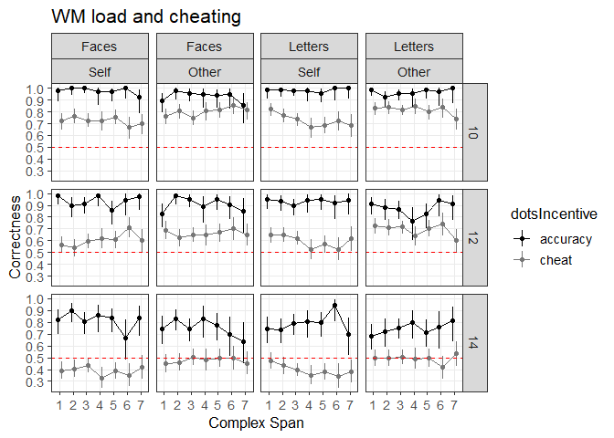
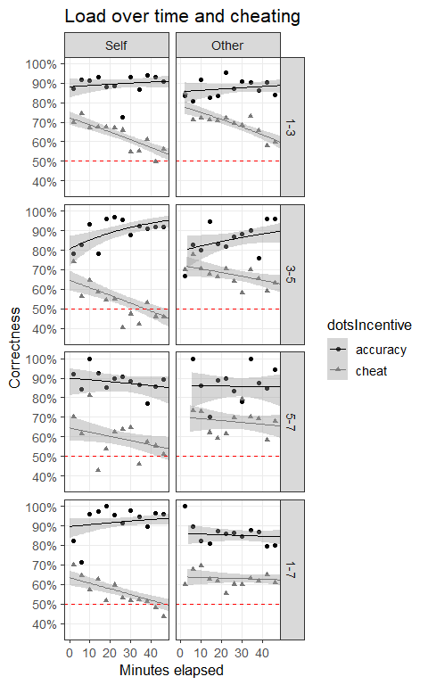
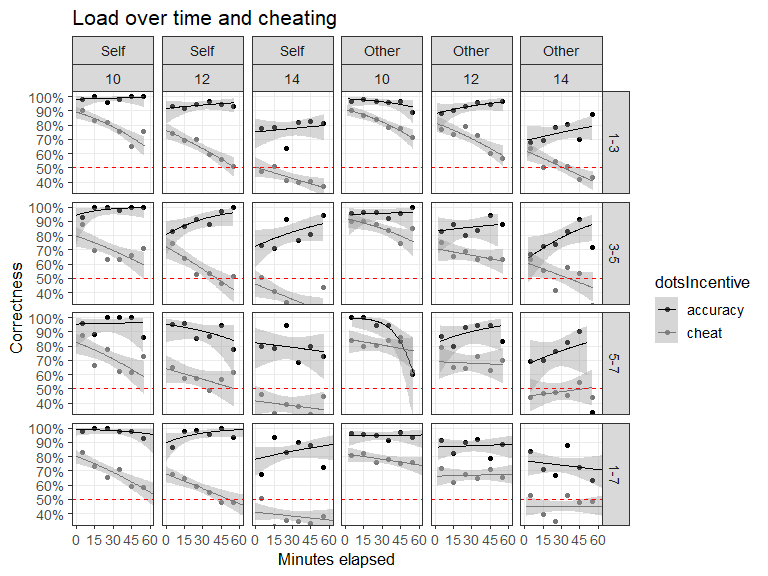
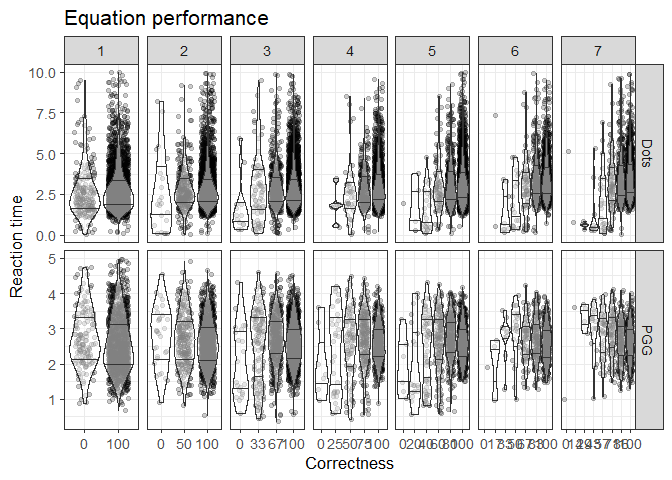
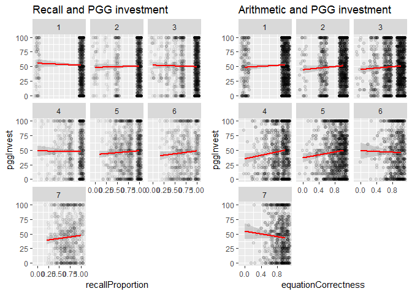

Morality in the time of cognitive famine - Dots task
================
Jonas Kristoffer Lindeløv
December, 2018

  - [About](#about)
  - [Setting up](#setting-up)
  - [Descriptives](#descriptives)
  - [WM Load and dots: Figure 4 and
    supplementary](#wm-load-and-dots-figure-4-and-supplementary)
  - [WM load and dots: inferential
    stuff](#wm-load-and-dots-inferential-stuff)
  - [Prepare for analyses of
    time-load](#prepare-for-analyses-of-time-load)
  - [Time-effects on dots: figure 5 and
    supplementary](#time-effects-on-dots-figure-5-and-supplementary)
  - [Effects of time (depletion, learning,
    etc.)](#effects-of-time-depletion-learning-etc.)
  - [Supplementary stuff](#supplementary-stuff)
      - [A validity check: Equation correctness and reaction
        time](#a-validity-check-equation-correctness-and-reaction-time)
      - [Percieved load (questionnaire
        data)](#percieved-load-questionnaire-data)

# About

This is part of the analysis that accompanies the paper “Morality in the
time of cognitive famine” by Panos, Jonas, Michaela, and others. You are
now looking at the analysis of **experiment 2** using the Dots Task to
study dishonesty (cheating)

# Setting up

Load appropriate stuff:

``` r
library(car)  # For some of the logistic regressions
library(tidyverse)
library(lme4)
library(kableExtra)

source('misc/functions utility.R')
source('misc/functions inference.R')  # Contains LRT and LRT_binom
```

You could redo the preprocessing of the original data if you wanted to.
It saves the data.frame in an .Rda file which is loaded in the sections
below.

``` r
source('preprocess dots.R')
```

``` r
D_dots = readRDS('data/dots.Rda')
D_dots = droplevels(subset(D_dots, condition == 'experiment'))  # Not practice, etc
D_dots = select(D_dots, -encode, -equationCorrect, -equationScores, -equationRTs, -recallAns, -equationAnss)  # Tidyr doesn't like these matrix columns and we won't
D = D_dots  # For convenience
```

# Descriptives

For manuscript:

``` r
# Just one row per subject to do descriptives on them
D_id = D[!duplicated(D$id), ]

# Per-group descriptives for paper
D_id %>%
  group_by(exp) %>%
  summarise(n=n(),
            age_years = sprintf('%.1f (%.1f)', mean(age), sd(age)),
            males = sprintf('%i (%.1f %%)', sum(gender=='male'), 100*sum(gender=='male')/n())) #%>%
```

    ## # A tibble: 2 x 4
    ##     exp     n age_years  males      
    ##   <dbl> <int> <chr>      <chr>      
    ## 1     3    77 23.7 (2.8) 33 (42.9 %)
    ## 2     4   120 23.7 (3.9) 61 (50.8 %)

``` r
  #kable() %>% 
  #kable_styling(bootstrap_options = "striped", full_width = F)
```

All groups stratified by level and stimType for supplementary:

``` r
x = D_id %>%  # Per-person
  group_by(stimType, level) %>%
  summarise(n=n(),
            males = sprintf('%i (%.1f %%)', sum(gender=='male'), 100*sum(gender=='male')/n()),
            age_years = sprintf('%.1f (%.1f)', mean(age), sd(age)))

y = D %>%  # All trials
  group_by(stimType, level) %>%
  summarise(arithmetic = sprintf('%.1f%%', mean(equationCorrectness)*100),
            recall = sprintf('%.1f%%', mean(recallProportion)*100))

bind_cols(x, y[,3:4]) #%>%
```

    ## # A tibble: 8 x 7
    ## # Groups:   stimType [2]
    ##   stimType level     n males       age_years  arithmetic recall
    ##   <fct>    <fct> <int> <chr>       <chr>      <chr>      <chr> 
    ## 1 Faces    1-3      20 10 (50.0 %) 25.8 (4.7) 95.8%      94.8% 
    ## 2 Faces    3-5      20 9 (45.0 %)  24.2 (2.8) 95.6%      77.8% 
    ## 3 Faces    5-7      22 9 (40.9 %)  21.2 (2.4) 93.0%      60.3% 
    ## 4 Faces    1-7      40 16 (40.0 %) 23.2 (2.6) 94.7%      74.1% 
    ## 5 Letters  1-3      19 11 (57.9 %) 24.2 (3.8) 91.5%      88.9% 
    ## 6 Letters  3-5      19 9 (47.4 %)  24.2 (4.5) 94.5%      91.1% 
    ## 7 Letters  5-7      20 13 (65.0 %) 23.0 (3.2) 95.9%      83.2% 
    ## 8 Letters  1-7      37 17 (45.9 %) 24.2 (3.1) 94.2%      87.9%

``` r
  #kable() %>% 
  #kable_styling(bootstrap_options = "striped", full_width = F)
```

# WM Load and dots: Figure 4 and supplementary

``` r
# Span and correctness
D$levelGroup = ifelse(D$level == '1-7', 'span 1-7', 'span 1-3, 3-5, 5-7')
D$levelGroup = factor(D$levelGroup, levels=c('span 1-7', 'span 1-3, 3-5, 5-7'))
D$incentiveLevel = with(D, interaction(dotsIncentive, level))

# The figure
# Note that binom.summary is hand-made (in utilities) to do binomial CIs.
figure4 = ggplot(D, aes(x=span, y=dotsCorrect, color=dotsIncentive, group=incentiveLevel)) +
  stat_summary(fun.data=binom.summary, size=0.3, position=position_dodge(0.5)) + 
  stat_summary(fun.y=mean, geom='line', position=position_dodge(0.5)) +
  
  # Alternative way of showing the trends. 
  # Closer to the inference model but further from the data.
  #binomial_smooth() + 
  #stat_summary(fun.y = mean, geom='point') + 
  
  # Styling
  geom_hline(aes(yintercept=0.5), color='red', lty=2) +
  scale_x_continuous(breaks=1:7) + scale_y_continuous(breaks=seq(-1, 1, 0.1 )) + 
  coord_cartesian(ylim=c(0.4, 1)) + 
  
  # Faceting
  facet_grid(levelGroup~dotsReceiver) +
  
  # Labels
  labs(title='WM load and cheating', y='Correctness', x='Complex Span')

# More styling
figure4 = style_my_plot(figure4) + 
   scale_colour_manual(values=c('black', '#777777'))
```

    ## Scale for 'colour' is already present. Adding another scale for
    ## 'colour', which will replace the existing scale.

``` r
# Save and plot it
ggsave('figures/Figure 4 - Dots and CS span.png', figure4, width=7, height=7, units='cm', dpi=300, scale=1.7)
figure4
```

<!-- -->

Supplementary figure - adds `dotsN` and `stimType` to the faceting:

``` r
figure4S = ggplot(D, aes(x=span, y=dotsCorrect, color=dotsIncentive)) + 
  stat_summary(fun.data=binom.summary, size=0.3, position=position_dodge(0.5)) + 
  stat_summary(fun.y=mean, geom='line', position=position_dodge(0.5)) +
  
  # Styling
  geom_hline(aes(yintercept=0.5), color='red', lty=2) +
  scale_x_continuous(breaks=1:7) + scale_y_continuous(breaks=seq(-1, 1, 0.1 )) + 
  coord_cartesian(ylim=c(0.25, 1)) + 
  labs(title='WM load and cheating', y='Correctness', x='Complex Span') +
  
  # Layout
  facet_grid(dotsN ~ stimType + dotsReceiver)

# More styling
figure4S = style_my_plot(figure4S) + 
  scale_colour_manual(values=c('black', '#777777'))
```

    ## Scale for 'colour' is already present. Adding another scale for
    ## 'colour', which will replace the existing scale.

``` r
# Save it and show it here
ggsave('figures/Figure 4S - Dots and CS span.png', figure4S, width=9, height=9, units='cm', dpi=300, scale=1.7)
figure4S
```

<!-- -->

# WM load and dots: inferential stuff

*Note on identifiability:* There is a tradeoff to be made in the models
below between having a full random structure and making the models
identifiable. I have tried keeping the model fairly maximal and verified
that simpler models yield the same qualitative conclusions as the
unidentifiable complex ones. One simplification is to remove `span` from
some of the models (including doing `(1|id)` instead of `(span|id)`)
because, as it turns out, `span` does not make a difference for the
chance of getting a correct `dotsCorrect`

Do subjects cheat? dotsIncentive makes this a difference-question
between cheating and accuracy incentives (testing `dotsIncentive`).

Notice that the reference level becomes quite a specific combination of
the fixed effects, but we are only interested in the effects, not the
intercept, so that’s OK.

``` r
LRT_binom(D,
          dotsCorrect ~ dotsIncentive + dotsReceiver + stimType + dotsN + time_hours + (1|id),
          dotsCorrect ~                 dotsReceiver + stimType + dotsN + time_hours + (1|id))
```

    ## Data: D
    ## Models:
    ## fit.null: dotsCorrect ~ dotsReceiver + stimType + dotsN + time_hours + 
    ## fit.null:     (1 | id)
    ## fit.full: dotsCorrect ~ dotsIncentive + dotsReceiver + stimType + dotsN + 
    ## fit.full:     time_hours + (1 | id)
    ##          Df   AIC   BIC  logLik deviance  Chisq Chi Df Pr(>Chisq)    
    ## fit.null  6 19833 19880 -9910.3    19821                             
    ## fit.full  7 18199 18254 -9092.4    18185 1635.9      1  < 2.2e-16 ***
    ## ---
    ## Signif. codes:  0 '***' 0.001 '**' 0.01 '*' 0.05 '.' 0.1 ' ' 1
    ##                       Estimate Std. Error     z value      Pr(>|z|)
    ## (Intercept)         7.83931356 0.19295111  40.6284964  0.000000e+00
    ## dotsIncentivecheat -1.96338552 0.05569392 -35.2531390 3.071276e-272
    ## dotsReceiverOther   0.35349221 0.03736216   9.4612364  3.043231e-21
    ## stimTypeLetters    -0.05119294 0.14406773  -0.3553394  7.223353e-01
    ## dotsN              -0.45493752 0.01215438 -37.4299341 1.273895e-306
    ## time_hours         -0.78136334 0.07032632 -11.1105396  1.114838e-28
    ##                                        2.5 %       97.5 %
    ## (Intercept)        2538.4617409 1739.1231572 3705.1936106
    ## dotsIncentivecheat    0.1403823    0.1258652    0.1565739
    ## dotsReceiverOther     1.4240319    1.3234788    1.5322246
    ## stimTypeLetters       0.9500953    0.7163686    1.2600793
    ## dotsN                 0.6344876    0.6195514    0.6497839
    ## time_hours            0.4577815    0.3988378    0.5254363
    ## [1] "BIC-based Bayes Factor: Inf"

Is cheating (the accuracy-cheating difference) modulated by receiver?
i.e., do participants cheat equally for personal gain and for the gain
of another?

``` r
LRT_binom(D,
          dotsCorrect ~ dotsIncentive * dotsReceiver + dotsN + time_hours + (1|id),
          dotsCorrect ~ dotsIncentive + dotsReceiver + dotsN + time_hours + (1|id))
```

    ## Data: D
    ## Models:
    ## fit.null: dotsCorrect ~ dotsIncentive + dotsReceiver + dotsN + time_hours + 
    ## fit.null:     (1 | id)
    ## fit.full: dotsCorrect ~ dotsIncentive * dotsReceiver + dotsN + time_hours + 
    ## fit.full:     (1 | id)
    ##          Df   AIC   BIC  logLik deviance Chisq Chi Df Pr(>Chisq)    
    ## fit.null  6 18197 18244 -9092.4    18185                            
    ## fit.full  7 18128 18183 -9057.0    18114 70.91      1  < 2.2e-16 ***
    ## ---
    ## Signif. codes:  0 '***' 0.001 '**' 0.01 '*' 0.05 '.' 0.1 ' ' 1
    ##                                        Estimate Std. Error    z value
    ## (Intercept)                           8.2515882 0.19015577  43.393835
    ## dotsIncentivecheat                   -2.4292772 0.08289203 -29.306524
    ## dotsReceiverOther                    -0.4338955 0.10133196  -4.281921
    ## dotsN                                -0.4575396 0.01219630 -37.514617
    ## time_hours                           -0.7911983 0.07053464 -11.217159
    ## dotsIncentivecheat:dotsReceiverOther  0.9147182 0.10925432   8.372375
    ##                                           Pr(>|z|)
    ## (Intercept)                           0.000000e+00
    ## dotsIncentivecheat                   8.564562e-189
    ## dotsReceiverOther                     1.852866e-05
    ## dotsN                                5.321405e-308
    ## time_hours                            3.358882e-29
    ## dotsIncentivecheat:dotsReceiverOther  5.646817e-17
    ##                                                          2.5 %
    ## (Intercept)                          3.833710e+03 2.640939e+03
    ## dotsIncentivecheat                   8.810048e-02 7.488942e-02
    ## dotsReceiverOther                    6.479800e-01 5.312607e-01
    ## dotsN                                6.328388e-01 6.178906e-01
    ## time_hours                           4.533013e-01 3.947733e-01
    ## dotsIncentivecheat:dotsReceiverOther 2.496072e+00 2.014928e+00
    ##                                            97.5 %
    ## (Intercept)                          5565.1912553
    ## dotsIncentivecheat                      0.1036421
    ## dotsReceiverOther                       0.7903428
    ## dotsN                                   0.6481486
    ## time_hours                              0.5205065
    ## dotsIncentivecheat:dotsReceiverOther    3.0921069
    ## [1] "BIC-based Bayes Factor: 18368711097031.5"

Is cheating (the accuracy-cheating difference) modulated by CS span?
I.e., do participants cheat equally across WM loads?

``` r
LRT_binom(subset(D, dotsReceiver == 'Self'),
          dotsCorrect ~ dotsIncentive*span + dotsN + time_hours + (1|id),
          dotsCorrect ~ dotsIncentive+span + dotsN + time_hours + (1|id))
```

    ## Data: D
    ## Models:
    ## fit.null: dotsCorrect ~ dotsIncentive + span + dotsN + time_hours + (1 | 
    ## fit.null:     id)
    ## fit.full: dotsCorrect ~ dotsIncentive * span + dotsN + time_hours + (1 | 
    ## fit.full:     id)
    ##          Df    AIC    BIC  logLik deviance  Chisq Chi Df Pr(>Chisq)
    ## fit.null  6 9263.9 9306.8 -4626.0   9251.9                         
    ## fit.full  7 9265.2 9315.3 -4625.6   9251.2 0.6945      1     0.4046
    ##                            Estimate Std. Error     z value      Pr(>|z|)
    ## (Intercept)              8.27940631 0.29895533  27.6944599 8.141731e-169
    ## dotsIncentivecheat      -2.36214673 0.18200115 -12.9787461  1.615029e-38
    ## span                     0.01989354 0.04330338   0.4593994  6.459474e-01
    ## dotsN                   -0.45962089 0.01731092 -26.5509157 2.506427e-155
    ## time_hours              -1.02641588 0.09803964 -10.4693969  1.194013e-25
    ## dotsIncentivecheat:span -0.03691258 0.04428689  -0.8334879  4.045696e-01
    ##                                             2.5 %       97.5 %
    ## (Intercept)             3.941853e+03 2.193963e+03 7082.2574201
    ## dotsIncentivecheat      9.421775e-02 6.594973e-02    0.1346023
    ## span                    1.020093e+00 9.370867e-01    1.1104514
    ## dotsN                   6.315230e-01 6.104556e-01    0.6533175
    ## time_hours              3.582888e-01 2.956526e-01    0.4341949
    ## dotsIncentivecheat:span 9.637604e-01 8.836332e-01    1.0511535
    ## [1] "BIC-based Bayes Factor: 68.7*"

``` r
LRT_binom(subset(D, dotsReceiver == 'Other'),
          dotsCorrect ~ dotsIncentive*span + dotsN + time_hours + (1|id),
          dotsCorrect ~ dotsIncentive+span + dotsN + time_hours + (1|id))
```

    ## Data: D
    ## Models:
    ## fit.null: dotsCorrect ~ dotsIncentive + span + dotsN + time_hours + (1 | 
    ## fit.null:     id)
    ## fit.full: dotsCorrect ~ dotsIncentive * span + dotsN + time_hours + (1 | 
    ## fit.full:     id)
    ##          Df    AIC    BIC  logLik deviance Chisq Chi Df Pr(>Chisq)
    ## fit.null  6 8972.8 9015.5 -4480.4   8960.8                        
    ## fit.full  7 8974.8 9024.6 -4480.4   8960.8 4e-04      1     0.9843
    ##                              Estimate Std. Error     z value      Pr(>|z|)
    ## (Intercept)              7.8936216200 0.28313492  27.8793640 4.747511e-171
    ## dotsIncentivecheat      -1.5194680474 0.15704012  -9.6756679  3.825854e-22
    ## span                     0.0185854013 0.03778680   0.4918491  6.228261e-01
    ## dotsN                   -0.4695307692 0.01769797 -26.5302014 4.346653e-155
    ## time_hours              -0.5461703633 0.10311349  -5.2967886  1.178570e-07
    ## dotsIncentivecheat:span -0.0008132204 0.03933048  -0.0206766  9.835036e-01
    ##                                             2.5 %       97.5 %
    ## (Intercept)             2680.1327878 1538.6910496 4668.3262128
    ## dotsIncentivecheat         0.2188283    0.1608535    0.2976982
    ## span                       1.0187592    0.9460353    1.0970735
    ## dotsN                      0.6252956    0.6039776    0.6473660
    ## time_hours                 0.5791636    0.4731849    0.7088781
    ## dotsIncentivecheat:span    0.9991871    0.9250574    1.0792573
    ## [1] "BIC-based Bayes Factor: 95.2*"

Does this cheating-span relationship replicate across dotsN (dots
ambiguity)?

``` r
LRT_binom(D,
          dotsCorrect ~ dotsIncentive*span*dotsN + dotsReceiver + time_hours + (1|id),
          dotsCorrect ~ dotsIncentive*span*dotsN + dotsReceiver + time_hours + (1|id) - dotsIncentive:span:dotsN)
```

    ## Data: D
    ## Models:
    ## fit.null: dotsCorrect ~ dotsIncentive * span * dotsN + dotsReceiver + time_hours + 
    ## fit.null:     (1 | id) - dotsIncentive:span:dotsN
    ## fit.full: dotsCorrect ~ dotsIncentive * span * dotsN + dotsReceiver + time_hours + 
    ## fit.full:     (1 | id)
    ##          Df   AIC   BIC  logLik deviance  Chisq Chi Df Pr(>Chisq)
    ## fit.null 10 18187 18265 -9083.5    18167                         
    ## fit.full 11 18189 18275 -9083.5    18167 0.0472      1      0.828
    ##                                    Estimate Std. Error      z value
    ## (Intercept)                    9.4871456608 1.04591356   9.07067853
    ## dotsIncentivecheat            -3.6658601752 1.09351876  -3.35235233
    ## span                           0.0177142314 0.25703237   0.06891829
    ## dotsN                         -0.5913112375 0.08003561  -7.38810203
    ## dotsReceiverOther              0.3523442250 0.03735017   9.43353751
    ## time_hours                    -0.7789979848 0.07027143 -11.08555706
    ## dotsIncentivecheat:span       -0.0708038550 0.26950524  -0.26271792
    ## dotsIncentivecheat:dotsN       0.1375864038 0.08439391   1.63028831
    ## span:dotsN                     0.0002380546 0.01975785   0.01204861
    ## dotsIncentivecheat:span:dotsN  0.0043966631 0.02084262   0.21094583
    ##                                   Pr(>|z|)
    ## (Intercept)                   1.182781e-19
    ## dotsIncentivecheat            8.012798e-04
    ## span                          9.450547e-01
    ## dotsN                         1.489394e-13
    ## dotsReceiverOther             3.964866e-21
    ## time_hours                    1.474299e-28
    ## dotsIncentivecheat:span       7.927680e-01
    ## dotsIncentivecheat:dotsN      1.030406e-01
    ## span:dotsN                    9.903868e-01
    ## dotsIncentivecheat:span:dotsN 8.329295e-01
    ##                                                   2.5 %       97.5 %
    ## (Intercept)                   1.318910e+04 1.697977e+03 1.024468e+05
    ## dotsIncentivecheat            2.558216e-02 3.000076e-03 2.181434e-01
    ## span                          1.017872e+00 6.150449e-01 1.684533e+00
    ## dotsN                         5.536009e-01 4.732279e-01 6.476244e-01
    ## dotsReceiverOther             1.422398e+00 1.321991e+00 1.530431e+00
    ## time_hours                    4.588656e-01 3.998253e-01 5.266240e-01
    ## dotsIncentivecheat:span       9.316446e-01 5.493473e-01 1.579987e+00
    ## dotsIncentivecheat:dotsN      1.147501e+00 9.725609e-01 1.353908e+00
    ## span:dotsN                    1.000238e+00 9.622446e-01 1.039732e+00
    ## dotsIncentivecheat:span:dotsN 1.004406e+00 9.642023e-01 1.046287e+00
    ## [1] "BIC-based Bayes Factor: 133*"

Is this relationship different for different stimulus types?

``` r
LRT_binom(D,
          dotsCorrect ~ dotsIncentive*span*stimType + dotsN + (1|id),
          dotsCorrect ~ dotsIncentive*span*stimType + dotsN + (1|id) - dotsIncentive:span:stimType)
```

    ## Data: D
    ## Models:
    ## fit.null: dotsCorrect ~ dotsIncentive * span * stimType + dotsN + (1 | 
    ## fit.null:     id) - dotsIncentive:span:stimType
    ## fit.full: dotsCorrect ~ dotsIncentive * span * stimType + dotsN + (1 | 
    ## fit.full:     id)
    ##          Df   AIC   BIC  logLik deviance  Chisq Chi Df Pr(>Chisq)    
    ## fit.null  9 18454 18525 -9218.2    18436                             
    ## fit.full 10 18433 18511 -9206.5    18413 23.376      1  1.332e-06 ***
    ## ---
    ## Signif. codes:  0 '***' 0.001 '**' 0.01 '*' 0.05 '.' 0.1 ' ' 1
    ##                                           Estimate Std. Error    z value
    ## (Intercept)                              8.4846448 0.25761602  32.935237
    ## dotsIncentivecheat                      -2.6095340 0.18139803 -14.385680
    ## span                                    -0.1113939 0.04134028  -2.694561
    ## stimTypeLetters                         -1.2342824 0.27105530  -4.553619
    ## dotsN                                   -0.4499223 0.01204097 -37.365952
    ## dotsIncentivecheat:span                  0.1322122 0.04231028   3.124824
    ## dotsIncentivecheat:stimTypeLetters       1.3415582 0.23666883   5.668504
    ## span:stimTypeLetters                     0.2561118 0.05671538   4.515738
    ## dotsIncentivecheat:span:stimTypeLetters -0.2810806 0.05814224  -4.834361
    ##                                              Pr(>|z|)
    ## (Intercept)                             6.883167e-238
    ## dotsIncentivecheat                       6.364944e-47
    ## span                                     7.048137e-03
    ## stimTypeLetters                          5.273092e-06
    ## dotsN                                   1.396522e-305
    ## dotsIncentivecheat:span                  1.779116e-03
    ## dotsIncentivecheat:stimTypeLetters       1.440497e-08
    ## span:stimTypeLetters                     6.309653e-06
    ## dotsIncentivecheat:span:stimTypeLetters  1.335742e-06
    ##                                                             2.5 %
    ## (Intercept)                             4.839878e+03 2.921132e+03
    ## dotsIncentivecheat                      7.356882e-02 5.155698e-02
    ## span                                    8.945863e-01 8.249608e-01
    ## stimTypeLetters                         2.910435e-01 1.710942e-01
    ## dotsN                                   6.376777e-01 6.228048e-01
    ## dotsIncentivecheat:span                 1.141350e+00 1.050520e+00
    ## dotsIncentivecheat:stimTypeLetters      3.824999e+00 2.405351e+00
    ## span:stimTypeLetters                    1.291897e+00 1.155984e+00
    ## dotsIncentivecheat:span:stimTypeLetters 7.549675e-01 6.736549e-01
    ##                                               97.5 %
    ## (Intercept)                             8018.9511686
    ## dotsIncentivecheat                         0.1049784
    ## span                                       0.9700880
    ## stimTypeLetters                            0.4950860
    ## dotsN                                      0.6529058
    ## dotsIncentivecheat:span                    1.2400340
    ## dotsIncentivecheat:stimTypeLetters         6.0825294
    ## span:stimTypeLetters                       1.4437905
    ## dotsIncentivecheat:span:stimTypeLetters    0.8460948
    ## [1] "BIC-based Bayes Factor: 873.1"

# Prepare for analyses of time-load

Before we dive into time-effects, we’ll make a data.frame called
`D_time` which excludes subjects who completed before the time window of
interest - and optionally those who were very slow. For the latter, you
could think that they were relaxed (not depleted) OR slowed by depletion
itself, so we think that it is ambiguous.

``` r
time_frame_lower = 45 * 60  # Which time frame to analyze. Try setting to 60 minutes.
time_frame_upper = 100 * 60  # Not used in paper, but feel free to use it here.

# Select subjects for analysis: only those who did not complete prematurely
completion_data = aggregate(time_secs~id, D, FUN=max)  # Vector of completion times
ids_fast = completion_data$id[completion_data$time_secs < time_frame_lower]
ids_slow = completion_data$id[completion_data$time_secs > time_frame_upper]
D_time = subset(D, !id %in% ids_fast & !id %in% ids_slow)

# Tell what's happening and how many were excluded
sprintf('M=%.02f minutes (SD=%.02f). %i excluded out of %i', 
        mean(completion_data$time_secs)/60, 
        sd(completion_data$time_secs)/60,
        length(ids_slow) + length(ids_fast), nrow(completion_data))
```

    ## [1] "M=54.31 minutes (SD=8.11). 21 excluded out of 196"

``` r
# Visualize what happened :-)
plot(sort(completion_data$time_secs)/60, ylim=c(20, 110), xlab='Participant (ordered)', ylab='Completion time (minutes)', main='Window of acceptance for completion times'); grid(); abline(h=c(time_frame_lower/60, time_frame_upper/60), col='red')
```

<!-- -->

``` r
# One subject has wrong/absent recording of trial time, so is not included
D_time = subset(D_time, !is.na(D_time$utc_start))
```

# Time-effects on dots: figure 5 and supplementary

For main text:

``` r
figure5 = ggplot(D_time, aes(x=time_secs/60, y=dotsCorrect, color=dotsIncentive, shape=dotsIncentive)) + 
  stat_summary_bin(fun.y=mean, geom='point', binwidth=4, size=1.5) + 
  binomial_smooth(size=0.5) +
  #stat_smooth(method='loess', geom='line', span=1) + 
  #stat_summary_bin(fun.data=binom.summary, binwidth=10, position=position_dodge(3), size=0.3) +
  #binomial_smooth(formula = y ~ splines::ns(x, 2)) +
  
  # Layout
  facet_grid(level~dotsReceiver) + 
  
  # Styling
  geom_hline(aes(yintercept=0.5), color='red', lty=2) +
  coord_cartesian(xlim=c(0, 46), ylim=c(0.35, 1)) +
  scale_x_continuous(breaks=seq(0, 100, 10)) + 
  scale_y_continuous(breaks=seq(0,1,0.1), labels=paste(seq(0, 1, 0.1)*100, '%', sep='')) +
  
  labs(title='Load over time and cheating', y='Correctness', x='Minutes elapsed')

# Style it a bit more
figure5 = style_my_plot(figure5) + 
  scale_colour_manual(values=c('black', '#777777'))

# Save it and show it here
ggsave('figures/Figure 5 - Dots and load over time.png', figure5, width=5, height=7.5, units='cm', dpi=300, scale=2.5)
figure5
```

<!-- -->

For the supplementary materials:

``` r
# SUPPLEMENTARY
figureS5 = ggplot(D, aes(x=time_secs/60, y=dotsCorrect, color=dotsIncentive)) + 
  #stat_summary_bin(geom='line', fun.y=mean, binwidth=1) +
  #stat_smooth(method='loess', geom='line', span=1) + 
  #stat_summary_bin(fun.data=binom.summary, binwidth=10, position=position_dodge(3), size=0.3) +
  stat_summary_bin(fun.y=mean, geom='point', binwidth=10, size=1.5) + 
  binomial_smooth(size=0.5) +
  
  # Layout
  facet_grid(level ~ dotsReceiver + dotsN) + 
  
  # Styling
  geom_hline(aes(yintercept=0.5), color='red', lty=2) +
  coord_cartesian(xlim=c(0, 60), ylim=c(0.35, 1)) +
  scale_x_continuous(breaks=seq(0, 100, 15)) + 
  scale_y_continuous(breaks=seq(0,1,0.1), labels=paste(seq(0, 1, 0.1)*100, '%', sep='')) + 
  
  labs(title='Load over time and cheating', y='Correctness', x='Minutes elapsed')

figureS5 = style_my_plot(figureS5) + 
  scale_colour_manual(values=c('black', '#777777'))
```

    ## Scale for 'colour' is already present. Adding another scale for
    ## 'colour', which will replace the existing scale.

``` r
ggsave('figures/Figure S5 - Dots and load over time.png', figureS5, width=9, height=4, units='cm', dpi=300, scale=2)
```

    ## Warning: Removed 84 rows containing non-finite values (stat_summary_bin).

    ## Warning: Removed 84 rows containing non-finite values (stat_smooth).

``` r
figureS5
```

    ## Warning: Removed 84 rows containing non-finite values (stat_summary_bin).
    
    ## Warning: Removed 84 rows containing non-finite values (stat_smooth).

<!-- -->

# Effects of time (depletion, learning, etc.)

`dotsIncentive` marks the difference between accuracy and
cheat-inventive trials; i.e. the magnitude of cheating. time\_hours is
the time passed since first trial, scaled to facilitate identifiability
in the model. The random effects structure captures some known design
features on which shrinkage would be nice. \* `dotsN` is fixed because
we do not consider them to be drawn randomly from a larger possible
number of dots and therefore do not want shrinkage of extreme N. \*
`stimType` is random because we think there could be many different
kinds of stimuli which would show the same pattern. \* slopes of
`time_hours` are random for each subject and there is no slope on `span`
(makes the model unidentifiable). We think that there should be
shrinkage to an overall time-trend. \* There is also a random offset for
each subject; reflecting good/bad days, I guess.

Is there a time-effect of the cheat-incentive overall?

``` r
LRT_binom(D_time,
          dotsCorrect ~ time_hours*dotsIncentive + dotsN + dotsReceiver + (time_hours|id),
          dotsCorrect ~ time_hours+dotsIncentive + dotsN + dotsReceiver + (time_hours|id))
```

    ## Data: D
    ## Models:
    ## fit.null: dotsCorrect ~ time_hours + dotsIncentive + dotsN + dotsReceiver + 
    ## fit.null:     (time_hours | id)
    ## fit.full: dotsCorrect ~ time_hours * dotsIncentive + dotsN + dotsReceiver + 
    ## fit.full:     (time_hours | id)
    ##          Df   AIC   BIC  logLik deviance  Chisq Chi Df Pr(>Chisq)    
    ## fit.null  8 16509 16571 -8246.5    16493                             
    ## fit.full  9 16434 16503 -8207.9    16416 77.283      1  < 2.2e-16 ***
    ## ---
    ## Signif. codes:  0 '***' 0.001 '**' 0.01 '*' 0.05 '.' 0.1 ' ' 1
    ##                                 Estimate Std. Error    z value
    ## (Intercept)                    8.0649708 0.19216424  41.969155
    ## time_hours                     0.8874062 0.22861158   3.881720
    ## dotsIncentivecheat            -2.0030858 0.05941107 -33.715699
    ## dotsN                         -0.4730468 0.01300433 -36.376109
    ## dotsReceiverOther              0.3797827 0.03968353   9.570284
    ## time_hours:dotsIncentivecheat -1.8553378 0.21114805  -8.786905
    ##                                    Pr(>|z|)
    ## (Intercept)                    0.000000e+00
    ## time_hours                     1.037201e-04
    ## dotsIncentivecheat            3.403748e-249
    ## dotsN                         1.016106e-289
    ## dotsReceiverOther              1.066123e-21
    ## time_hours:dotsIncentivecheat  1.537368e-18
    ##                                                   2.5 %       97.5 %
    ## (Intercept)                   3181.0632066 2182.7389572 4635.9932739
    ## time_hours                       2.4288216    1.5516762    3.8018077
    ## dotsIncentivecheat               0.1349183    0.1200881    0.1515799
    ## dotsN                            0.6231009    0.6074200    0.6391866
    ## dotsReceiverOther                1.4619668    1.3525671    1.5802151
    ## time_hours:dotsIncentivecheat    0.1564001    0.1033969    0.2365738
    ## [1] "BIC-based Bayes Factor: 464100942392028"

Is there a time-effect on the ability to do the task (depletion or
learning)?

``` r
LRT_binom(subset(D_time, dotsIncentive == 'accuracy'),
          dotsCorrect ~ time_hours + dotsN + dotsReceiver + (time_hours|id),
          dotsCorrect ~          1 + dotsN + dotsReceiver + (time_hours|id))
```

    ## Data: D
    ## Models:
    ## fit.null: dotsCorrect ~ 1 + dotsN + dotsReceiver + (time_hours | id)
    ## fit.full: dotsCorrect ~ time_hours + dotsN + dotsReceiver + (time_hours | 
    ## fit.full:     id)
    ##          Df  AIC    BIC  logLik deviance  Chisq Chi Df Pr(>Chisq)  
    ## fit.null  6 2725 2763.2 -1356.5     2713                           
    ## fit.full  7 2723 2767.5 -1354.5     2709 4.0228      1    0.04489 *
    ## ---
    ## Signif. codes:  0 '***' 0.001 '**' 0.01 '*' 0.05 '.' 0.1 ' ' 1
    ##                     Estimate Std. Error    z value     Pr(>|z|)
    ## (Intercept)        9.7053821 0.51432653  18.870079 2.009982e-79
    ## time_hours         0.5315689 0.26309918   2.020413 4.334061e-02
    ## dotsN             -0.5749659 0.03817012 -15.063247 2.825625e-51
    ## dotsReceiverOther -0.4782920 0.10681479  -4.477769 7.542719e-06
    ##                                       2.5 %       97.5 %
    ## (Intercept)       1.640567e+04 5986.8498545 4.495618e+04
    ## time_hours        1.701600e+00    1.0160311 2.849757e+00
    ## dotsN             5.627241e-01    0.5221617 6.064374e-01
    ## dotsReceiverOther 6.198412e-01    0.5027586 7.641900e-01
    ## [1] "BIC-based Bayes Factor: 8.7*"

Is there a time-effect on the “ability to cheat”, i.e., does cheating
increase over time?

``` r
LRT_binom(subset(D_time, dotsIncentive == 'cheat'),
          dotsCorrect ~ time_hours + dotsN + dotsReceiver + (time_hours|id),
          dotsCorrect ~          1 + dotsN + dotsReceiver + (time_hours|id))
```

    ## Data: D
    ## Models:
    ## fit.null: dotsCorrect ~ 1 + dotsN + dotsReceiver + (time_hours | id)
    ## fit.full: dotsCorrect ~ time_hours + dotsN + dotsReceiver + (time_hours | 
    ## fit.full:     id)
    ##          Df   AIC   BIC  logLik deviance Chisq Chi Df Pr(>Chisq)    
    ## fit.null  6 12666 12710 -6326.8    12654                            
    ## fit.full  7 12633 12685 -6309.4    12619 34.98      1  3.331e-09 ***
    ## ---
    ## Signif. codes:  0 '***' 0.001 '**' 0.01 '*' 0.05 '.' 0.1 ' ' 1
    ##                     Estimate Std. Error    z value      Pr(>|z|)
    ## (Intercept)        6.5337405 0.21855013  29.895844 2.228443e-196
    ## time_hours        -1.2893040 0.20868087  -6.178352  6.477397e-10
    ## dotsN             -0.5238772 0.01523477 -34.386934 3.953495e-259
    ## dotsReceiverOther  0.5991645 0.04610022  12.996997  1.272421e-38
    ##                                     2.5 %       97.5 %
    ## (Intercept)       687.9667455 448.2674882 1055.8388806
    ## time_hours          0.2754624   0.1829923    0.4146597
    ## dotsN               0.5922200   0.5747979    0.6101701
    ## dotsReceiverOther   1.8205970   1.6633102    1.9927573
    ## [1] "BIC-based Bayes Factor: 349479.9"

Do the different difficulty levels cause different time-effects?

``` r
D_time$level_numeric = as.numeric(D_time$level)  # Numeric to make it ordered according to the hypothesis
LRT_binom(subset(D_time, level_numeric != 4),  # Leave out the mixed group (1-7)
          dotsCorrect ~ time_hours*dotsIncentive*level_numeric + dotsN + dotsReceiver + (time_hours|id),
          dotsCorrect ~ time_hours*dotsIncentive*level_numeric + dotsN + dotsReceiver + (time_hours|id) - time_hours:dotsIncentive:level_numeric)
```

    ## Data: D
    ## Models:
    ## fit.null: dotsCorrect ~ time_hours * dotsIncentive * level_numeric + dotsN + 
    ## fit.null:     dotsReceiver + (time_hours | id) - time_hours:dotsIncentive:level_numeric
    ## fit.full: dotsCorrect ~ time_hours * dotsIncentive * level_numeric + dotsN + 
    ## fit.full:     dotsReceiver + (time_hours | id)
    ##          Df   AIC   BIC  logLik deviance  Chisq Chi Df Pr(>Chisq)  
    ## fit.null 12 11174 11262 -5575.1    11150                           
    ## fit.full 13 11173 11269 -5573.6    11147 3.0072      1    0.08289 .
    ## ---
    ## Signif. codes:  0 '***' 0.001 '**' 0.01 '*' 0.05 '.' 0.1 ' ' 1
    ##                                                Estimate Std. Error
    ## (Intercept)                                  8.36567746 0.35066817
    ## time_hours                                   1.42793698 0.71220738
    ## dotsIncentivecheat                          -2.03376018 0.17095077
    ## level_numeric                               -0.11797578 0.13980870
    ## dotsN                                       -0.48094206 0.01583086
    ## dotsReceiverOther                            0.40064178 0.04812384
    ## time_hours:dotsIncentivecheat               -3.23206812 0.63000683
    ## time_hours:level_numeric                    -0.20007712 0.37152557
    ## dotsIncentivecheat:level_numeric             0.05337376 0.09355097
    ## time_hours:dotsIncentivecheat:level_numeric  0.60006860 0.34381323
    ##                                                 z value      Pr(>|z|)
    ## (Intercept)                                  23.8563922 8.692013e-126
    ## time_hours                                    2.0049455  4.496887e-02
    ## dotsIncentivecheat                          -11.8967592  1.230328e-32
    ## level_numeric                                -0.8438372  3.987604e-01
    ## dotsN                                       -30.3800371 1.008237e-202
    ## dotsReceiverOther                             8.3252251  8.416863e-17
    ## time_hours:dotsIncentivecheat                -5.1302112  2.894172e-07
    ## time_hours:level_numeric                     -0.5385285  5.902122e-01
    ## dotsIncentivecheat:level_numeric              0.5705314  5.683173e-01
    ## time_hours:dotsIncentivecheat:level_numeric   1.7453331  8.092691e-02
    ##                                                                 2.5 %
    ## (Intercept)                                 4.297022e+03 2.161117e+03
    ## time_hours                                  4.170087e+00 1.032555e+00
    ## dotsIncentivecheat                          1.308426e-01 9.359133e-02
    ## level_numeric                               8.887176e-01 6.757070e-01
    ## dotsN                                       6.182007e-01 5.993138e-01
    ## dotsReceiverOther                           1.492782e+00 1.358418e+00
    ## time_hours:dotsIncentivecheat               3.947577e-02 1.148333e-02
    ## time_hours:level_numeric                    8.186676e-01 3.952433e-01
    ## dotsIncentivecheat:level_numeric            1.054824e+00 8.781106e-01
    ## time_hours:dotsIncentivecheat:level_numeric 1.822244e+00 9.288640e-01
    ##                                                   97.5 %
    ## (Intercept)                                 8543.9136162
    ## time_hours                                    16.8413604
    ## dotsIncentivecheat                             0.1829207
    ## level_numeric                                  1.1688779
    ## dotsN                                          0.6376829
    ## dotsReceiverOther                              1.6404372
    ## time_hours:dotsIncentivecheat                  0.1357042
    ## time_hours:level_numeric                       1.6957068
    ## dotsIncentivecheat:level_numeric               1.2670993
    ## time_hours:dotsIncentivecheat:level_numeric    3.5748748
    ## [1] "BIC-based Bayes Factor: 24*"

Does perceived depletion alter the observed slope change?

``` r
LRT_binom(subset(D_time, !is.na(subjectiveDepletion)),
          dotsCorrect ~ time_hours*dotsIncentive*subjectiveDepletion + dotsN + dotsReceiver + (time_hours|id),
          dotsCorrect ~ time_hours*dotsIncentive*subjectiveDepletion + dotsN + dotsReceiver + (time_hours|id) - time_hours:dotsIncentive:subjectiveDepletion)
```

    ## Data: D
    ## Models:
    ## fit.null: dotsCorrect ~ time_hours * dotsIncentive * subjectiveDepletion + 
    ## fit.null:     dotsN + dotsReceiver + (time_hours | id) - time_hours:dotsIncentive:subjectiveDepletion
    ## fit.full: dotsCorrect ~ time_hours * dotsIncentive * subjectiveDepletion + 
    ## fit.full:     dotsN + dotsReceiver + (time_hours | id)
    ##          Df   AIC   BIC  logLik deviance  Chisq Chi Df Pr(>Chisq)
    ## fit.null 12 15955 16047 -7965.3    15931                         
    ## fit.full 13 15955 16055 -7964.4    15929 1.7432      1     0.1867
    ##                                                      Estimate Std. Error
    ## (Intercept)                                        8.85553737 0.45139750
    ## time_hours                                         1.21811301 1.04677593
    ## dotsIncentivecheat                                -3.40395359 0.26544792
    ## subjectiveDepletion                               -0.04499732 0.02182453
    ## dotsN                                             -0.47513907 0.01322155
    ## dotsReceiverOther                                  0.37694676 0.04028311
    ## time_hours:dotsIncentivecheat                     -2.96563389 0.96984983
    ## time_hours:subjectiveDepletion                    -0.02393540 0.05477222
    ## dotsIncentivecheat:subjectiveDepletion             0.08121250 0.01400200
    ## time_hours:dotsIncentivecheat:subjectiveDepletion  0.06703069 0.05084884
    ##                                                       z value
    ## (Intercept)                                        19.6180471
    ## time_hours                                          1.1636808
    ## dotsIncentivecheat                                -12.8234327
    ## subjectiveDepletion                                -2.0617777
    ## dotsN                                             -35.9367128
    ## dotsReceiverOther                                   9.3574390
    ## time_hours:dotsIncentivecheat                      -3.0578279
    ## time_hours:subjectiveDepletion                     -0.4369989
    ## dotsIncentivecheat:subjectiveDepletion              5.8000628
    ## time_hours:dotsIncentivecheat:subjectiveDepletion   1.3182344
    ##                                                        Pr(>|z|)
    ## (Intercept)                                        1.084397e-85
    ## time_hours                                         2.445534e-01
    ## dotsIncentivecheat                                 1.212128e-37
    ## subjectiveDepletion                                3.922890e-02
    ## dotsN                                             8.162865e-283
    ## dotsReceiverOther                                  8.169272e-21
    ## time_hours:dotsIncentivecheat                      2.229476e-03
    ## time_hours:subjectiveDepletion                     6.621121e-01
    ## dotsIncentivecheat:subjectiveDepletion             6.629010e-09
    ## time_hours:dotsIncentivecheat:subjectiveDepletion  1.874252e-01
    ##                                                               
    ## (Intercept)                                       7.013116e+03
    ## time_hours                                        3.380802e+00
    ## dotsIncentivecheat                                3.324159e-02
    ## subjectiveDepletion                               9.560000e-01
    ## dotsN                                             6.217986e-01
    ## dotsReceiverOther                                 1.457827e+00
    ## time_hours:dotsIncentivecheat                     5.152780e-02
    ## time_hours:subjectiveDepletion                    9.763488e-01
    ## dotsIncentivecheat:subjectiveDepletion            1.084601e+00
    ## time_hours:dotsIncentivecheat:subjectiveDepletion 1.069328e+00
    ##                                                          2.5 %
    ## (Intercept)                                       2.895215e+03
    ## time_hours                                        4.345127e-01
    ## dotsIncentivecheat                                1.975750e-02
    ## subjectiveDepletion                               9.159691e-01
    ## dotsN                                             6.058924e-01
    ## dotsReceiverOther                                 1.347153e+00
    ## time_hours:dotsIncentivecheat                     7.700234e-03
    ## time_hours:subjectiveDepletion                    8.769661e-01
    ## dotsIncentivecheat:subjectiveDepletion            1.055241e+00
    ## time_hours:dotsIncentivecheat:subjectiveDepletion 9.678954e-01
    ##                                                         97.5 %
    ## (Intercept)                                       1.698796e+04
    ## time_hours                                        2.630492e+01
    ## dotsIncentivecheat                                5.592827e-02
    ## subjectiveDepletion                               9.977804e-01
    ## dotsN                                             6.381223e-01
    ## dotsReceiverOther                                 1.577593e+00
    ## time_hours:dotsIncentivecheat                     3.448095e-01
    ## time_hours:subjectiveDepletion                    1.086994e+00
    ## dotsIncentivecheat:subjectiveDepletion            1.114779e+00
    ## time_hours:dotsIncentivecheat:subjectiveDepletion 1.181391e+00
    ## [1] "BIC-based Bayes Factor: 53.7*"

Is the time-trend on cheating different for self- and other-receivers?

``` r
LRT_binom(D_time,
          dotsCorrect ~ time_hours*dotsIncentive*dotsReceiver + dotsN + (time_hours|id),
          dotsCorrect ~ time_hours*dotsIncentive*dotsReceiver + dotsN + (time_hours|id) - time_hours:dotsIncentive:dotsReceiver)
```

    ## Data: D
    ## Models:
    ## fit.null: dotsCorrect ~ time_hours * dotsIncentive * dotsReceiver + dotsN + 
    ## fit.null:     (time_hours | id) - time_hours:dotsIncentive:dotsReceiver
    ## fit.full: dotsCorrect ~ time_hours * dotsIncentive * dotsReceiver + dotsN + 
    ## fit.full:     (time_hours | id)
    ##          Df   AIC   BIC  logLik deviance  Chisq Chi Df Pr(>Chisq)  
    ## fit.null 11 16354 16439 -8166.0    16332                           
    ## fit.full 12 16351 16444 -8163.4    16327 5.2546      1    0.02189 *
    ## ---
    ## Signif. codes:  0 '***' 0.001 '**' 0.01 '*' 0.05 '.' 0.1 ' ' 1
    ##                                                   Estimate Std. Error
    ## (Intercept)                                      8.5726009 0.20443510
    ## time_hours                                       1.2970963 0.31083613
    ## dotsIncentivecheat                              -2.5362182 0.08919651
    ## dotsReceiverOther                               -0.5054036 0.10761557
    ## dotsN                                           -0.4766138 0.01306894
    ## time_hours:dotsIncentivecheat                   -2.4907815 0.30690999
    ## time_hours:dotsReceiverOther                    -0.4991578 0.38519943
    ## dotsIncentivecheat:dotsReceiverOther             1.0251493 0.11628185
    ## time_hours:dotsIncentivecheat:dotsReceiverOther  0.9547203 0.41667790
    ##                                                    z value      Pr(>|z|)
    ## (Intercept)                                      41.933117  0.000000e+00
    ## time_hours                                        4.172926  3.007121e-05
    ## dotsIncentivecheat                              -28.434053 7.674021e-178
    ## dotsReceiverOther                                -4.696380  2.648133e-06
    ## dotsN                                           -36.469208 3.413264e-291
    ## time_hours:dotsIncentivecheat                    -8.115674  4.830951e-16
    ## time_hours:dotsReceiverOther                     -1.295843  1.950297e-01
    ## dotsIncentivecheat:dotsReceiverOther              8.816073  1.185438e-18
    ## time_hours:dotsIncentivecheat:dotsReceiverOther   2.291267  2.194798e-02
    ##                                                                     2.5 %
    ## (Intercept)                                     5.284857e+03 3.540118e+03
    ## time_hours                                      3.658658e+00 1.989471e+00
    ## dotsIncentivecheat                              7.916522e-02 6.646763e-02
    ## dotsReceiverOther                               6.032621e-01 4.885438e-01
    ## dotsN                                           6.208822e-01 6.051805e-01
    ## time_hours:dotsIncentivecheat                   8.284520e-02 4.539678e-02
    ## time_hours:dotsReceiverOther                    6.070417e-01 2.853226e-01
    ## dotsIncentivecheat:dotsReceiverOther            2.787512e+00 2.219409e+00
    ## time_hours:dotsIncentivecheat:dotsReceiverOther 2.597944e+00 1.148029e+00
    ##                                                       97.5 %
    ## (Intercept)                                     7.889486e+03
    ## time_hours                                      6.728310e+00
    ## dotsIncentivecheat                              9.428848e-02
    ## dotsReceiverOther                               7.449182e-01
    ## dotsN                                           6.369914e-01
    ## time_hours:dotsIncentivecheat                   1.511853e-01
    ## time_hours:dotsReceiverOther                    1.291519e+00
    ## dotsIncentivecheat:dotsReceiverOther            3.501031e+00
    ## time_hours:dotsIncentivecheat:dotsReceiverOther 5.879043e+00
    ## [1] "BIC-based Bayes Factor: 9.4*"

# Supplementary stuff

## A validity check: Equation correctness and reaction time

(see the notebook on PGG for this) An important part of the complex span
task is that subjects engage in the processing task, thereby preventing
chunking- or rehearsal strategies. We provided a monetary incentive to
do the processing task correctly.

Still, it is possible that some subjects would prioritize it lower in
order to improve recall, and such behavior would undermine the purpose
of using a complex span task, making it more like a simple forward
letter span task.

We considered what indices would reveal such behavior. A priori, it is
hard to distinguish between poor math skills and laziness. Similarly, it
is difficult to distinguish between being a low-span subject or just not
investing an effort to encode the items.

However, short reaction times in combination with low accuracy would be
one such index: poor performance and no effort (time) to improve it. We
show the data for the equation tasks descriptively below using violin
plots with 25% and 75% quartiles as well as (horizontally) jittered
data.

Across tasks (PGG and Dots) and span levels (1-7), for all correctness
levels where there is a considerable amount of data, the reaction times
are highly similar. Only for correctness levels with very little data do
we observe deviations from this, likely due to noise. We conclude that,
to the best of our knowledge, the task was succesful in engaging
subjects in processing.

FIrst, let’s load the PGG data in here:

``` r
# Load the data.frame (not in csv because the matrix columns would be lost)
D_pgg = readRDS('data/pgg.Rda')
D_pgg = subset(D_pgg, condition=='experiment')  # Remove practice, etc.
D_pgg = select(D_pgg, -encode, -equationCorrect, -equationScores, -equationRTs, -recallAns, -equationAnss)  # Tidyr doesn't like these matrix columns and we won't be using them
D_pgg = droplevels(D_pgg)
```

And merge the data together:

``` r
D_all = plyr::rbind.fill(D_dots, D_pgg)  # All together now!
D_all$task = ifelse(D_all$exp %in% c(1,2), 'PGG', 'Dots')
```

Now, for the actual analysis:

``` r
fit = lmer(dotsRT ~ level + stimType + (1|id), subset(D_all, exp==4))

#D.plot = subset(D_all, 
ggplot(subset(D_all, equationRT < 10), aes(x=factor(round(equationCorrectness*100)), y=equationRT)) + 
  #stat_summary(fun.data=mean_cl_boot) + 
  geom_jitter(width=0.3, height=0, alpha=0.2) +   # Only jitter width
  geom_violin(draw_quantiles = c(0.25, 0.75), alpha=0.5, scale='width') + 
  facet_grid(task~span, scales='free') + 
  #coord_cartesian(ylim=c(0, 7)) + 
  labs(x='Correctness', y='Reaction time', title='Equation performance') + 
  #scale_x_continuous(breaks= scales::pretty_breaks()) +
  theme_bw(13)
```

<!-- -->

``` r
# TODO: Methods: RT for PGG
#fit = lmer(pggRT ~ level + stimType + (1|id), subset(D, exp==2))
```

If one wants to look at performance anyway (equations and recall), we
can do that. First plot it:

``` r
# Recall
tradeoff_recall = ggplot(D_pgg, aes(x=recallProportion, y=pggInvest)) + 
  #geom_density2d() +
  geom_jitter(width=0.05, height=0, alpha=0.05) + 
  geom_smooth(color='red', method=lm) +
  facet_wrap(~span, ncol=3) + 
  labs(title='Recall and PGG investment')

# Equations
tradeoff_equation = ggplot(D_pgg, aes(x=equationCorrectness, y=pggInvest)) + 
  #geom_density2d() +
  geom_jitter(width=0.1, height=0, alpha=0.1) + 
  geom_smooth(color='red', method=lm) +
  facet_wrap(~span, ncol=3) + 
  labs(title='Arithmetic and PGG investment')

# All together now
library(patchwork)
tradeoff_recall + tradeoff_equation
```

<!-- -->

Then inferentially:

``` r
LRT(D_pgg,
    pggInvest ~ recallProportion  + equationCorrectness + stimType + time_hours + (span|id),
    pggInvest ~                                         + stimType + time_hours + (span|id))
```

    ## Warning in checkConv(attr(opt, "derivs"), opt$par, ctrl =
    ## control$checkConv, : Model failed to converge with max|grad| = 0.0308827
    ## (tol = 0.002, component 1)

    ## Data: D
    ## Models:
    ## fit.null: pggInvest ~ +stimType + time_hours + (span | id)
    ## fit.full: pggInvest ~ recallProportion + equationCorrectness + stimType + 
    ## fit.full:     time_hours + (span | id)
    ##          Df   AIC   BIC logLik deviance  Chisq Chi Df Pr(>Chisq)    
    ## fit.null  7 78719 78769 -39353    78705                             
    ## fit.full  9 78677 78740 -39329    78659 46.896      2  6.557e-11 ***
    ## ---
    ## Signif. codes:  0 '***' 0.001 '**' 0.01 '*' 0.05 '.' 0.1 ' ' 1
    ##                        Estimate Std. Error   t value
    ## (Intercept)          38.9911344   2.652091 14.702037
    ## recallProportion      4.8223646   1.327090  3.633790
    ## equationCorrectness   6.4234649   1.178004  5.452838
    ## stimTypeLetters       0.8484201   3.678132  0.230666
    ## time_hours          -15.1218557   2.613593 -5.785849
    ##                                      2.5 %    97.5 %
    ## (Intercept)          38.9911344  33.793132 44.189136
    ## recallProportion      4.8223646   2.221317  7.423413
    ## equationCorrectness   6.4234649   4.114620  8.732310
    ## stimTypeLetters       0.8484201  -6.360587  8.057427
    ## time_hours          -15.1218557 -20.244404 -9.999307
    ## [1] "BIC-based Bayes Factor: 1774408.3"

… and for the dots task:

``` r
LRT_binom(D_dots,
    dotsCorrect ~ recallProportion + equationCorrectness + dotsIncentive + dotsN + stimType + (time_hours|id),
    dotsCorrect ~                                      1 + dotsIncentive + dotsN + stimType + (time_hours|id))
```

    ## Warning in checkConv(attr(opt, "derivs"), opt$par, ctrl =
    ## control$checkConv, : Model failed to converge with max|grad| = 0.00269189
    ## (tol = 0.001, component 1)

    ## Data: D
    ## Models:
    ## fit.null: dotsCorrect ~ 1 + dotsIncentive + dotsN + stimType + (time_hours | 
    ## fit.null:     id)
    ## fit.full: dotsCorrect ~ recallProportion + equationCorrectness + dotsIncentive + 
    ## fit.full:     dotsN + stimType + (time_hours | id)
    ##          Df   AIC   BIC  logLik deviance  Chisq Chi Df Pr(>Chisq)  
    ## fit.null  7 18075 18130 -9030.3    18061                           
    ## fit.full  9 18074 18144 -9027.9    18056 4.8723      2     0.0875 .
    ## ---
    ## Signif. codes:  0 '***' 0.001 '**' 0.01 '*' 0.05 '.' 0.1 ' ' 1
    ##                         Estimate Std. Error      z value      Pr(>|z|)
    ## (Intercept)          8.210625425 0.23106287  35.53416189 1.459478e-276
    ## recallProportion    -0.139519336 0.07764113  -1.79697721  7.233924e-02
    ## equationCorrectness  0.181872520 0.12313250   1.47704719  1.396630e-01
    ## dotsIncentivecheat  -2.011372983 0.05672626 -35.45752860 2.220678e-275
    ## dotsN               -0.461973279 0.01234848 -37.41135919 2.554002e-306
    ## stimTypeLetters     -0.005207303 0.13325368  -0.03907812  9.688281e-01
    ##                                         2.5 %       97.5 %
    ## (Intercept)         3679.8432128 2339.6357222 5787.7583003
    ## recallProportion       0.8697762    0.7469977    1.0127349
    ## equationCorrectness    1.1994613    0.9422706    1.5268515
    ## dotsIncentivecheat     0.1338048    0.1197254    0.1495400
    ## dotsN                  0.6300392    0.6149737    0.6454738
    ## stimTypeLetters        0.9948062    0.7661481    1.2917077
    ## [1] "BIC-based Bayes Factor: 1621.4*"

## Percieved load (questionnaire data)

Mostly for exploratory reasons, we did ask subjects how they perceived
the task with respect to frustration, stress, effort, difficulty, and
satisfaction. Here, we explore whether subjects “felt” the difference in
load.

First, we turn to Experiment 2 and the Public Goods Game. The estimated
differences between difficulty levels is very small (around 0.3) on a
scale with range 6. If ignoring this quantitative observation, the
effect seems to be that as you get to span 4 and above, the perceived
load is constant.

Again we see very small correspondences when considering the range-6
scale, but a large degree of the probability density is towards positive
values.

``` r
perceived_load_cols = c('qStress', 'qDifficulty', 'qFrustration', 'qEffort', 'qSatisfied')

# Summarise per subject
D_id_dots = D_dots %>%
  mutate(qSatisfied = 1 + (7 - qSatisfied),  # Same direction as other questions
         perceived_load = rowMeans(select(D_dots, perceived_load_cols))) %>%  # Mean of load ratings
  group_by(id, level) %>%
  filter(dotsReceiver=='Self' & dotsIncentive == 'cheat') %>%
  summarise(dotsCorrect = mean(dotsCorrect, na.rm=T),
            perceived_load = mean(perceived_load))

# Plot the relationship
ggplot(D_id_dots, aes(x=level, y=perceived_load)) + 
  geom_violin(draw_quantiles = c(0.25, 0.5, 0.75)) + 
  geom_jitter(width=0.2, height=0) +
  labs(x = 'Difficulty level (span)', y='Perceived load', title='Do participants perceive the objective load?')
```

<!-- -->

Test it inferentially:

``` r
library(brms)
```

    ## Loading required package: Rcpp

    ## Loading 'brms' package (version 2.8.0). Useful instructions
    ## can be found by typing help('brms'). A more detailed introduction
    ## to the package is available through vignette('brms_overview').

    ## 
    ## Attaching package: 'brms'

    ## The following object is masked from 'package:lme4':
    ## 
    ##     ngrps

``` r
D.analyse.dots = filter(D_id_dots, level !='1-7' & !is.na(perceived_load))  # ... and no NA data
result_level_dots = brm(perceived_load ~ level, D.analyse.dots)  # Quick: just run with the defaults
```

    ## Compiling the C++ model

    ## Start sampling

    ## 
    ## SAMPLING FOR MODEL 'b94071416f3a7b8410afdbf79caf67f5' NOW (CHAIN 1).
    ## Chain 1: 
    ## Chain 1: Gradient evaluation took 0 seconds
    ## Chain 1: 1000 transitions using 10 leapfrog steps per transition would take 0 seconds.
    ## Chain 1: Adjust your expectations accordingly!
    ## Chain 1: 
    ## Chain 1: 
    ## Chain 1: Iteration:    1 / 2000 [  0%]  (Warmup)
    ## Chain 1: Iteration:  200 / 2000 [ 10%]  (Warmup)
    ## Chain 1: Iteration:  400 / 2000 [ 20%]  (Warmup)
    ## Chain 1: Iteration:  600 / 2000 [ 30%]  (Warmup)
    ## Chain 1: Iteration:  800 / 2000 [ 40%]  (Warmup)
    ## Chain 1: Iteration: 1000 / 2000 [ 50%]  (Warmup)
    ## Chain 1: Iteration: 1001 / 2000 [ 50%]  (Sampling)
    ## Chain 1: Iteration: 1200 / 2000 [ 60%]  (Sampling)
    ## Chain 1: Iteration: 1400 / 2000 [ 70%]  (Sampling)
    ## Chain 1: Iteration: 1600 / 2000 [ 80%]  (Sampling)
    ## Chain 1: Iteration: 1800 / 2000 [ 90%]  (Sampling)
    ## Chain 1: Iteration: 2000 / 2000 [100%]  (Sampling)
    ## Chain 1: 
    ## Chain 1:  Elapsed Time: 0.056 seconds (Warm-up)
    ## Chain 1:                0.056 seconds (Sampling)
    ## Chain 1:                0.112 seconds (Total)
    ## Chain 1: 
    ## 
    ## SAMPLING FOR MODEL 'b94071416f3a7b8410afdbf79caf67f5' NOW (CHAIN 2).
    ## Chain 2: 
    ## Chain 2: Gradient evaluation took 0 seconds
    ## Chain 2: 1000 transitions using 10 leapfrog steps per transition would take 0 seconds.
    ## Chain 2: Adjust your expectations accordingly!
    ## Chain 2: 
    ## Chain 2: 
    ## Chain 2: Iteration:    1 / 2000 [  0%]  (Warmup)
    ## Chain 2: Iteration:  200 / 2000 [ 10%]  (Warmup)
    ## Chain 2: Iteration:  400 / 2000 [ 20%]  (Warmup)
    ## Chain 2: Iteration:  600 / 2000 [ 30%]  (Warmup)
    ## Chain 2: Iteration:  800 / 2000 [ 40%]  (Warmup)
    ## Chain 2: Iteration: 1000 / 2000 [ 50%]  (Warmup)
    ## Chain 2: Iteration: 1001 / 2000 [ 50%]  (Sampling)
    ## Chain 2: Iteration: 1200 / 2000 [ 60%]  (Sampling)
    ## Chain 2: Iteration: 1400 / 2000 [ 70%]  (Sampling)
    ## Chain 2: Iteration: 1600 / 2000 [ 80%]  (Sampling)
    ## Chain 2: Iteration: 1800 / 2000 [ 90%]  (Sampling)
    ## Chain 2: Iteration: 2000 / 2000 [100%]  (Sampling)
    ## Chain 2: 
    ## Chain 2:  Elapsed Time: 0.059 seconds (Warm-up)
    ## Chain 2:                0.055 seconds (Sampling)
    ## Chain 2:                0.114 seconds (Total)
    ## Chain 2: 
    ## 
    ## SAMPLING FOR MODEL 'b94071416f3a7b8410afdbf79caf67f5' NOW (CHAIN 3).
    ## Chain 3: 
    ## Chain 3: Gradient evaluation took 0 seconds
    ## Chain 3: 1000 transitions using 10 leapfrog steps per transition would take 0 seconds.
    ## Chain 3: Adjust your expectations accordingly!
    ## Chain 3: 
    ## Chain 3: 
    ## Chain 3: Iteration:    1 / 2000 [  0%]  (Warmup)
    ## Chain 3: Iteration:  200 / 2000 [ 10%]  (Warmup)
    ## Chain 3: Iteration:  400 / 2000 [ 20%]  (Warmup)
    ## Chain 3: Iteration:  600 / 2000 [ 30%]  (Warmup)
    ## Chain 3: Iteration:  800 / 2000 [ 40%]  (Warmup)
    ## Chain 3: Iteration: 1000 / 2000 [ 50%]  (Warmup)
    ## Chain 3: Iteration: 1001 / 2000 [ 50%]  (Sampling)
    ## Chain 3: Iteration: 1200 / 2000 [ 60%]  (Sampling)
    ## Chain 3: Iteration: 1400 / 2000 [ 70%]  (Sampling)
    ## Chain 3: Iteration: 1600 / 2000 [ 80%]  (Sampling)
    ## Chain 3: Iteration: 1800 / 2000 [ 90%]  (Sampling)
    ## Chain 3: Iteration: 2000 / 2000 [100%]  (Sampling)
    ## Chain 3: 
    ## Chain 3:  Elapsed Time: 0.06 seconds (Warm-up)
    ## Chain 3:                0.057 seconds (Sampling)
    ## Chain 3:                0.117 seconds (Total)
    ## Chain 3: 
    ## 
    ## SAMPLING FOR MODEL 'b94071416f3a7b8410afdbf79caf67f5' NOW (CHAIN 4).
    ## Chain 4: 
    ## Chain 4: Gradient evaluation took 0 seconds
    ## Chain 4: 1000 transitions using 10 leapfrog steps per transition would take 0 seconds.
    ## Chain 4: Adjust your expectations accordingly!
    ## Chain 4: 
    ## Chain 4: 
    ## Chain 4: Iteration:    1 / 2000 [  0%]  (Warmup)
    ## Chain 4: Iteration:  200 / 2000 [ 10%]  (Warmup)
    ## Chain 4: Iteration:  400 / 2000 [ 20%]  (Warmup)
    ## Chain 4: Iteration:  600 / 2000 [ 30%]  (Warmup)
    ## Chain 4: Iteration:  800 / 2000 [ 40%]  (Warmup)
    ## Chain 4: Iteration: 1000 / 2000 [ 50%]  (Warmup)
    ## Chain 4: Iteration: 1001 / 2000 [ 50%]  (Sampling)
    ## Chain 4: Iteration: 1200 / 2000 [ 60%]  (Sampling)
    ## Chain 4: Iteration: 1400 / 2000 [ 70%]  (Sampling)
    ## Chain 4: Iteration: 1600 / 2000 [ 80%]  (Sampling)
    ## Chain 4: Iteration: 1800 / 2000 [ 90%]  (Sampling)
    ## Chain 4: Iteration: 2000 / 2000 [100%]  (Sampling)
    ## Chain 4: 
    ## Chain 4:  Elapsed Time: 0.059 seconds (Warm-up)
    ## Chain 4:                0.064 seconds (Sampling)
    ## Chain 4:                0.123 seconds (Total)
    ## Chain 4:

``` r
plot(result_level_dots, pars='^b_')
```

<!-- -->

… and now for degree of cheating:

``` r
# Plot it
ggplot(D_id_dots, aes(x=dotsCorrect, y=perceived_load)) + 
  geom_point() +
  geom_smooth(method='lm') +
  labs(x='Dots correctness', y='Perceived load', title='Do participants cheat based on perceived load?')
```

<!-- -->

Test it inferentially:

``` r
# Inferentially
result_cheat_dots = brm(perceived_load ~ dotsCorrect, D.analyse.dots)  # Simple linear regression
```

    ## Compiling the C++ model

    ## recompiling to avoid crashing R session

    ## Start sampling

    ## 
    ## SAMPLING FOR MODEL 'b94071416f3a7b8410afdbf79caf67f5' NOW (CHAIN 1).
    ## Chain 1: 
    ## Chain 1: Gradient evaluation took 0 seconds
    ## Chain 1: 1000 transitions using 10 leapfrog steps per transition would take 0 seconds.
    ## Chain 1: Adjust your expectations accordingly!
    ## Chain 1: 
    ## Chain 1: 
    ## Chain 1: Iteration:    1 / 2000 [  0%]  (Warmup)
    ## Chain 1: Iteration:  200 / 2000 [ 10%]  (Warmup)
    ## Chain 1: Iteration:  400 / 2000 [ 20%]  (Warmup)
    ## Chain 1: Iteration:  600 / 2000 [ 30%]  (Warmup)
    ## Chain 1: Iteration:  800 / 2000 [ 40%]  (Warmup)
    ## Chain 1: Iteration: 1000 / 2000 [ 50%]  (Warmup)
    ## Chain 1: Iteration: 1001 / 2000 [ 50%]  (Sampling)
    ## Chain 1: Iteration: 1200 / 2000 [ 60%]  (Sampling)
    ## Chain 1: Iteration: 1400 / 2000 [ 70%]  (Sampling)
    ## Chain 1: Iteration: 1600 / 2000 [ 80%]  (Sampling)
    ## Chain 1: Iteration: 1800 / 2000 [ 90%]  (Sampling)
    ## Chain 1: Iteration: 2000 / 2000 [100%]  (Sampling)
    ## Chain 1: 
    ## Chain 1:  Elapsed Time: 0.049 seconds (Warm-up)
    ## Chain 1:                0.051 seconds (Sampling)
    ## Chain 1:                0.1 seconds (Total)
    ## Chain 1: 
    ## 
    ## SAMPLING FOR MODEL 'b94071416f3a7b8410afdbf79caf67f5' NOW (CHAIN 2).
    ## Chain 2: 
    ## Chain 2: Gradient evaluation took 0 seconds
    ## Chain 2: 1000 transitions using 10 leapfrog steps per transition would take 0 seconds.
    ## Chain 2: Adjust your expectations accordingly!
    ## Chain 2: 
    ## Chain 2: 
    ## Chain 2: Iteration:    1 / 2000 [  0%]  (Warmup)
    ## Chain 2: Iteration:  200 / 2000 [ 10%]  (Warmup)
    ## Chain 2: Iteration:  400 / 2000 [ 20%]  (Warmup)
    ## Chain 2: Iteration:  600 / 2000 [ 30%]  (Warmup)
    ## Chain 2: Iteration:  800 / 2000 [ 40%]  (Warmup)
    ## Chain 2: Iteration: 1000 / 2000 [ 50%]  (Warmup)
    ## Chain 2: Iteration: 1001 / 2000 [ 50%]  (Sampling)
    ## Chain 2: Iteration: 1200 / 2000 [ 60%]  (Sampling)
    ## Chain 2: Iteration: 1400 / 2000 [ 70%]  (Sampling)
    ## Chain 2: Iteration: 1600 / 2000 [ 80%]  (Sampling)
    ## Chain 2: Iteration: 1800 / 2000 [ 90%]  (Sampling)
    ## Chain 2: Iteration: 2000 / 2000 [100%]  (Sampling)
    ## Chain 2: 
    ## Chain 2:  Elapsed Time: 0.049 seconds (Warm-up)
    ## Chain 2:                0.061 seconds (Sampling)
    ## Chain 2:                0.11 seconds (Total)
    ## Chain 2: 
    ## 
    ## SAMPLING FOR MODEL 'b94071416f3a7b8410afdbf79caf67f5' NOW (CHAIN 3).
    ## Chain 3: 
    ## Chain 3: Gradient evaluation took 0 seconds
    ## Chain 3: 1000 transitions using 10 leapfrog steps per transition would take 0 seconds.
    ## Chain 3: Adjust your expectations accordingly!
    ## Chain 3: 
    ## Chain 3: 
    ## Chain 3: Iteration:    1 / 2000 [  0%]  (Warmup)
    ## Chain 3: Iteration:  200 / 2000 [ 10%]  (Warmup)
    ## Chain 3: Iteration:  400 / 2000 [ 20%]  (Warmup)
    ## Chain 3: Iteration:  600 / 2000 [ 30%]  (Warmup)
    ## Chain 3: Iteration:  800 / 2000 [ 40%]  (Warmup)
    ## Chain 3: Iteration: 1000 / 2000 [ 50%]  (Warmup)
    ## Chain 3: Iteration: 1001 / 2000 [ 50%]  (Sampling)
    ## Chain 3: Iteration: 1200 / 2000 [ 60%]  (Sampling)
    ## Chain 3: Iteration: 1400 / 2000 [ 70%]  (Sampling)
    ## Chain 3: Iteration: 1600 / 2000 [ 80%]  (Sampling)
    ## Chain 3: Iteration: 1800 / 2000 [ 90%]  (Sampling)
    ## Chain 3: Iteration: 2000 / 2000 [100%]  (Sampling)
    ## Chain 3: 
    ## Chain 3:  Elapsed Time: 0.054 seconds (Warm-up)
    ## Chain 3:                0.068 seconds (Sampling)
    ## Chain 3:                0.122 seconds (Total)
    ## Chain 3: 
    ## 
    ## SAMPLING FOR MODEL 'b94071416f3a7b8410afdbf79caf67f5' NOW (CHAIN 4).
    ## Chain 4: 
    ## Chain 4: Gradient evaluation took 0 seconds
    ## Chain 4: 1000 transitions using 10 leapfrog steps per transition would take 0 seconds.
    ## Chain 4: Adjust your expectations accordingly!
    ## Chain 4: 
    ## Chain 4: 
    ## Chain 4: Iteration:    1 / 2000 [  0%]  (Warmup)
    ## Chain 4: Iteration:  200 / 2000 [ 10%]  (Warmup)
    ## Chain 4: Iteration:  400 / 2000 [ 20%]  (Warmup)
    ## Chain 4: Iteration:  600 / 2000 [ 30%]  (Warmup)
    ## Chain 4: Iteration:  800 / 2000 [ 40%]  (Warmup)
    ## Chain 4: Iteration: 1000 / 2000 [ 50%]  (Warmup)
    ## Chain 4: Iteration: 1001 / 2000 [ 50%]  (Sampling)
    ## Chain 4: Iteration: 1200 / 2000 [ 60%]  (Sampling)
    ## Chain 4: Iteration: 1400 / 2000 [ 70%]  (Sampling)
    ## Chain 4: Iteration: 1600 / 2000 [ 80%]  (Sampling)
    ## Chain 4: Iteration: 1800 / 2000 [ 90%]  (Sampling)
    ## Chain 4: Iteration: 2000 / 2000 [100%]  (Sampling)
    ## Chain 4: 
    ## Chain 4:  Elapsed Time: 0.052 seconds (Warm-up)
    ## Chain 4:                0.063 seconds (Sampling)
    ## Chain 4:                0.115 seconds (Total)
    ## Chain 4:

``` r
plot(result_cheat_dots, pars='b_dotsCorrect')
```

<!-- -->
