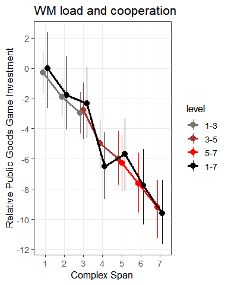
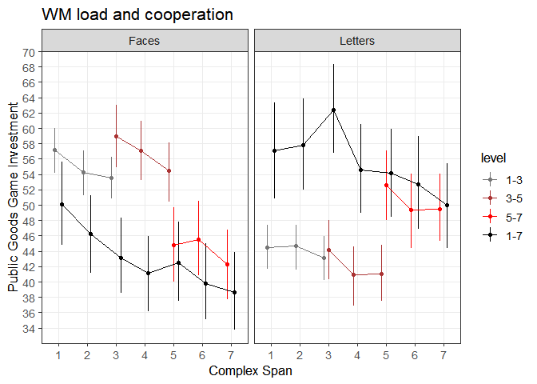
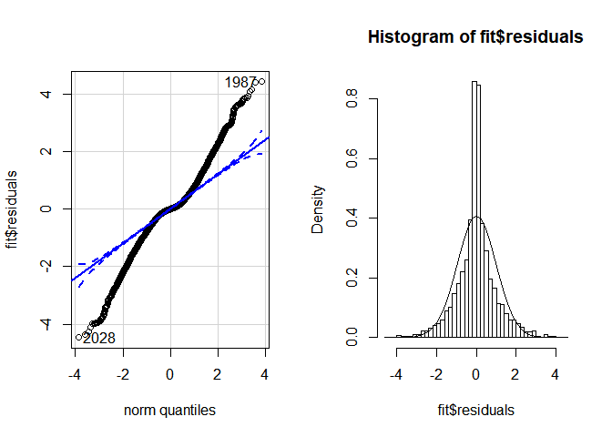
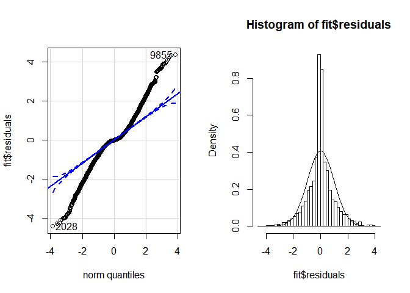
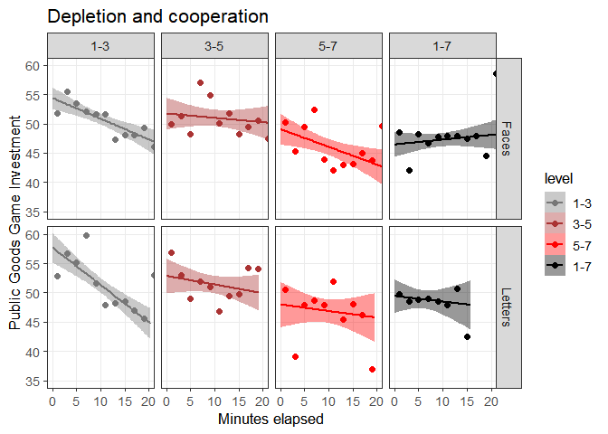
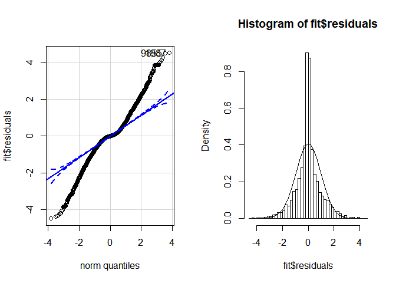
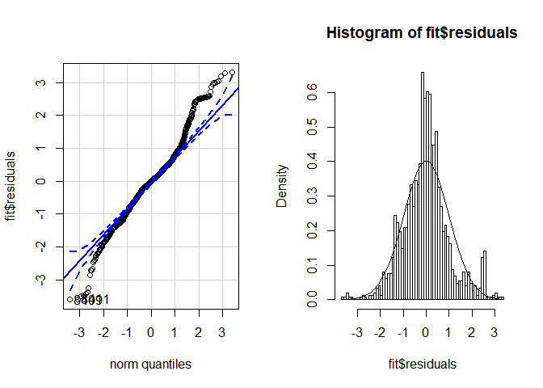

<!--
# TO DO
* Number of trials per subject as a criterion?
-->
About
=====

This is the analysis that accompanies the paper "Morality in the time of
cognitive famine" by Panos, Jonas, Michaela, and....

To be continuted...

Setting up
==========

Load appropriate stuff:

    library(tidyverse)
    library(lme4)
    library(kableExtra)

    source('misc/functions utility.R')
    source('misc/functions inference.R')  # Contains LRT and LRT_binom

You could redo the preprocessing of the original data if you wanted to.
It saves the data.frames which are loaded in the sections below.

    source('preprocess PGG.R')

Experiment 1 and 2: Public Goods Game and cooperation
=====================================================

Load data
---------

... and remove two subjects who did not follow instructions (noted by
the research assistant)

    # Load the data.frame (not in csv because the matrix columns would be lost)
    D_pgg = readRDS('data/pgg.Rda')
    D_pgg = subset(D_pgg, condition=='experiment')  # Remove practice, etc.
    D_pgg = select(D_pgg, -encode, -equationCorrect, -equationScores, -equationRTs, -recallAns, -equationAnss)  # Tidyr doesn't like these matrix columns and we won't be using them
    D_pgg = droplevels(D_pgg)
    D = D_pgg  # For convenience

Descriptives
------------

    D_id = D[!duplicated(D$id), ]

    # Per-group descriptives for paper
    D_id %>%
      group_by(exp) %>%
      summarise(
        n=n(),
        age_years = sprintf('%.1f (%.1f)', mean(age), sd(age)),
        males = sprintf('%i (%.1f %%)', sum(gender=='male'), 100*sum(gender=='male')/n())
      ) %>%
      kable() %>% 
      kable_styling(bootstrap_options = "striped", full_width = F)

<table class="table table-striped" style="width: auto !important; margin-left: auto; margin-right: auto;">
<thead>
<tr>
<th style="text-align:right;">
exp
</th>
<th style="text-align:right;">
n
</th>
<th style="text-align:left;">
age\_years
</th>
<th style="text-align:left;">
males
</th>
</tr>
</thead>
<tbody>
<tr>
<td style="text-align:right;">
1
</td>
<td style="text-align:right;">
81
</td>
<td style="text-align:left;">
23.4 (2.9)
</td>
<td style="text-align:left;">
40 (49.4 %)
</td>
</tr>
<tr>
<td style="text-align:right;">
2
</td>
<td style="text-align:right;">
159
</td>
<td style="text-align:left;">
24.2 (4.3)
</td>
<td style="text-align:left;">
72 (45.3 %)
</td>
</tr>
</tbody>
</table>
    # Supplementary table: stratified by level and stimType descriptives
    x = D_id %>%  # Per-person
      group_by(stimType, level) %>%
      summarise(
        n=n(),
        males = sprintf('%i (%.1f %%)', sum(gender=='male'), 100*sum(gender=='male')/n()),
        age_years = sprintf('%.1f (%.1f)', mean(age), sd(age))
      )

    y = D %>%  # All trials
      group_by(stimType, level) %>%
      summarise(
        arithmetic = sprintf('%.1f%%', mean(equationCorrectness)*100),
        recall = sprintf('%.1f%%', mean(recallProportion)*100)
      )

    bind_cols(x, y[,3:4]) %>%
      kable() %>% 
      kable_styling(bootstrap_options = "striped", full_width = F)

<table class="table table-striped" style="width: auto !important; margin-left: auto; margin-right: auto;">
<thead>
<tr>
<th style="text-align:left;">
stimType
</th>
<th style="text-align:left;">
level
</th>
<th style="text-align:right;">
n
</th>
<th style="text-align:left;">
males
</th>
<th style="text-align:left;">
age\_years
</th>
<th style="text-align:left;">
arithmetic
</th>
<th style="text-align:left;">
recall
</th>
</tr>
</thead>
<tbody>
<tr>
<td style="text-align:left;">
Faces
</td>
<td style="text-align:left;">
1-3
</td>
<td style="text-align:right;">
38
</td>
<td style="text-align:left;">
18 (47.4 %)
</td>
<td style="text-align:left;">
24.3 (3.6)
</td>
<td style="text-align:left;">
90.0%
</td>
<td style="text-align:left;">
92.3%
</td>
</tr>
<tr>
<td style="text-align:left;">
Faces
</td>
<td style="text-align:left;">
3-5
</td>
<td style="text-align:right;">
30
</td>
<td style="text-align:left;">
15 (50.0 %)
</td>
<td style="text-align:left;">
24.2 (3.1)
</td>
<td style="text-align:left;">
84.7%
</td>
<td style="text-align:left;">
82.6%
</td>
</tr>
<tr>
<td style="text-align:left;">
Faces
</td>
<td style="text-align:left;">
5-7
</td>
<td style="text-align:right;">
33
</td>
<td style="text-align:left;">
15 (45.5 %)
</td>
<td style="text-align:left;">
23.6 (2.2)
</td>
<td style="text-align:left;">
89.8%
</td>
<td style="text-align:left;">
69.3%
</td>
</tr>
<tr>
<td style="text-align:left;">
Faces
</td>
<td style="text-align:left;">
1-7
</td>
<td style="text-align:right;">
50
</td>
<td style="text-align:left;">
24 (48.0 %)
</td>
<td style="text-align:left;">
23.3 (2.5)
</td>
<td style="text-align:left;">
87.7%
</td>
<td style="text-align:left;">
81.8%
</td>
</tr>
<tr>
<td style="text-align:left;">
Letters
</td>
<td style="text-align:left;">
1-3
</td>
<td style="text-align:right;">
20
</td>
<td style="text-align:left;">
5 (25.0 %)
</td>
<td style="text-align:left;">
24.2 (2.7)
</td>
<td style="text-align:left;">
88.8%
</td>
<td style="text-align:left;">
85.5%
</td>
</tr>
<tr>
<td style="text-align:left;">
Letters
</td>
<td style="text-align:left;">
3-5
</td>
<td style="text-align:right;">
21
</td>
<td style="text-align:left;">
10 (47.6 %)
</td>
<td style="text-align:left;">
25.6 (9.3)
</td>
<td style="text-align:left;">
81.0%
</td>
<td style="text-align:left;">
89.0%
</td>
</tr>
<tr>
<td style="text-align:left;">
Letters
</td>
<td style="text-align:left;">
5-7
</td>
<td style="text-align:right;">
17
</td>
<td style="text-align:left;">
9 (52.9 %)
</td>
<td style="text-align:left;">
23.2 (1.9)
</td>
<td style="text-align:left;">
89.0%
</td>
<td style="text-align:left;">
84.7%
</td>
</tr>
<tr>
<td style="text-align:left;">
Letters
</td>
<td style="text-align:left;">
1-7
</td>
<td style="text-align:right;">
31
</td>
<td style="text-align:left;">
16 (51.6 %)
</td>
<td style="text-align:left;">
23.4 (3.4)
</td>
<td style="text-align:left;">
82.1%
</td>
<td style="text-align:left;">
83.3%
</td>
</tr>
</tbody>
</table>
Concurrent load: Figure 2
-------------------------

    # Fit a simple mixed model to show the results while subtracting individual differences
    fit_full = lmer(pggInvest ~ span*stimType + (1|id), D)

    # Add the fits to the data
    x = ranef(fit_full)  # random effects for each subject
    D$pggInvestOffset = mapvalues2(D$id, from=rownames(x$id), to=x$id$`(Intercept)`)  # map it unto data
    df_tmp = subset(D, span==1 & level=='1-7')
    y_offset = mean(df_tmp$pggInvest - df_tmp$pggInvestOffset, na.rm=T)
    D$pggInvestZeroCenter = D$pggInvest - D$pggInvestOffset - y_offset

    # Plot the figure
    figure2 = ggplot(D, aes(x=span, y=pggInvestZeroCenter, color=level)) + 
      stat_summary(fun.data='mean_cl_boot', position=position_dodge(0.5), size=0.7) +
      stat_summary(fun.y=mean, geom="line", position=position_dodge(0.5), lwd=1.3) +
      #facet_grid(~stimType) +
      labs(title='WM load and cooperation', y='Relative Public Goods Game Investment', x='Complex Span') + 
      scale_x_continuous(breaks=1:7) + scale_y_continuous(breaks=seq(-100, 100, 2))

    figure2 = style_my_plot(figure2)

    # Save it
    ggsave('figures/Figure 2 - PGG and CS span.png', figure2, width=6, height=6, units='cm', dpi=300, scale=1.7)

    # Show it 
    figure2

Supplementary figure:

    figureS2 = ggplot(D, aes(x=span, y=pggInvest, color=level)) + 
      stat_summary(fun.data='mean_cl_boot', position=position_dodge(0.5), size=0.3) +
      stat_summary(fun.y=mean, geom="line", position=position_dodge(0.5)) +
      facet_grid(~stimType) +
      labs(title='WM load and cooperation', y='Public Goods Game Investment', x='Complex Span') + 
      scale_x_continuous(breaks=1:7) + scale_y_continuous(breaks=seq(-100, 100, 2))

    figureS2 = style_my_plot(figureS2)
    figureS2

    ggsave('figures/Figure S2 - PGG and CS span.png', figureS2, width=9, height=6, units='cm', dpi=300, scale=1.7)

Concurrent load: inference
--------------------------

Main test:

    LRT(D, 
        pggInvest ~ span + stimType + time_hours + (span|id), 
        pggInvest ~    1 + stimType + time_hours + (span|id))

    ## Loading required package: carData

    ## 
    ## Attaching package: 'car'

    ## The following object is masked from 'package:dplyr':
    ## 
    ##     recode

    ## The following object is masked from 'package:purrr':
    ## 
    ##     some

    ## Data: D
    ## Models:
    ## fit.null: pggInvest ~ 1 + stimType + time_hours + (span | id)
    ## fit.full: pggInvest ~ span + stimType + time_hours + (span | id)
    ##          Df   AIC   BIC logLik deviance  Chisq Chi Df Pr(>Chisq)    
    ## fit.null  7 78719 78769 -39353    78705                             
    ## fit.full  8 78694 78750 -39339    78678 27.459      1  1.605e-07 ***
    ## ---
    ## Signif. codes:  0 '***' 0.001 '**' 0.01 '*' 0.05 '.' 0.1 ' ' 1
    ##                    Estimate Std. Error    t value
    ## (Intercept)      54.7362254  2.5260937 21.6683276
    ## span             -1.4923343  0.2759033 -5.4089035
    ## stimTypeLetters   0.9039497  3.6677525  0.2464588
    ## time_hours      -14.2485176  2.6163446 -5.4459637
    ##                                  2.5 %     97.5 %
    ## (Intercept)      54.7362254  49.785173 59.6872780
    ## span             -1.4923343  -2.033095 -0.9515738
    ## stimTypeLetters   0.9039497  -6.284713  8.0926126
    ## time_hours      -14.2485176 -19.376459 -9.1205765
    ## [1] "BIC-based Bayes Factor: 9895.5"

    # Bayesian version (takes a looooooong time to run!)
    # Needs well-considered priors
    # library(brms)
    # full = brm(pggInvest ~ span + (1 + span|id) + (1|stimType), D, chains=5, cores=5, iter=650, warmup=150)
    # null = brm(pggInvest ~ 1 + (1 + span|id) + (1|stimType), D, chains=5, cores=5, iter=650, warmup=150)
    # bayes_factor(full, null)

Effect of CS stimulus type:

    LRT(D, 
        pggInvest ~ span * stimType + time_hours + (span|id), 
        pggInvest ~ span + stimType + time_hours + (span|id))

    ## Loading required package: carData

    ## 
    ## Attaching package: 'car'

    ## The following object is masked from 'package:dplyr':
    ## 
    ##     recode

    ## The following object is masked from 'package:purrr':
    ## 
    ##     some

    ## Data: D
    ## Models:
    ## fit.null: pggInvest ~ span + stimType + time_hours + (span | id)
    ## fit.full: pggInvest ~ span * stimType + time_hours + (span | id)
    ##          Df   AIC   BIC logLik deviance  Chisq Chi Df Pr(>Chisq)
    ## fit.null  8 78694 78750 -39339    78678                         
    ## fit.full  9 78695 78759 -39339    78677 0.8079      1     0.3687
    ##                         Estimate Std. Error    t value
    ## (Intercept)           55.5956888  2.7011955 20.5818828
    ## span                  -1.6952891  0.3558676 -4.7638201
    ## stimTypeLetters       -1.2486390  4.3818656 -0.2849560
    ## time_hours           -14.2605085  2.6163296 -5.4505781
    ## span:stimTypeLetters   0.5059617  0.5622568  0.8998766
    ##                                        2.5 %     97.5 %
    ## (Intercept)           55.5956888  50.3014430 60.8899347
    ## span                  -1.6952891  -2.3927768 -0.9978015
    ## stimTypeLetters       -1.2486390  -9.8369377  7.3396597
    ## time_hours           -14.2605085 -19.3884202 -9.1325968
    ## span:stimTypeLetters   0.5059617  -0.5960414  1.6079648
    ## [1] "BIC-based Bayes Factor: 61.9*"

Effect of difficulty level:

    LRT(D, 
        pggInvest ~ span * level + (1+span|id),
        pggInvest ~ span + level + (1+span|id))

    ## Data: D
    ## Models:
    ## fit.null: pggInvest ~ span + level + (1 + span | id)
    ## fit.full: pggInvest ~ span * level + (1 + span | id)
    ##          Df   AIC   BIC logLik deviance  Chisq Chi Df Pr(>Chisq)
    ## fit.null  9 78725 78789 -39354    78707                         
    ## fit.full 12 78731 78816 -39353    78707 0.1844      3     0.9801
    ##                 Estimate Std. Error    t value
    ## (Intercept)   53.6809800  4.0132275 13.3760123
    ## span          -1.3047155  0.5884244 -2.2173035
    ## level3-5       3.9014284  6.3486302  0.6145307
    ## level5-7       1.7116150  7.6440063  0.2239160
    ## level1-7       0.5430098  5.2932280  0.1025858
    ## span:level3-5 -0.2968346  0.9528663 -0.3115175
    ## span:level5-7 -0.1862893  1.0761494 -0.1731073
    ## span:level1-7 -0.2889102  0.7001542 -0.4126380
    ##                               2.5 %     97.5 %
    ## (Intercept)   53.6809800  45.815199 61.5467613
    ## span          -1.3047155  -2.458006 -0.1514249
    ## level3-5       3.9014284  -8.541658 16.3445150
    ## level5-7       1.7116150 -13.270362 16.6935920
    ## level1-7       0.5430098  -9.831526 10.9175461
    ## span:level3-5 -0.2968346  -2.164418  1.5707492
    ## span:level5-7 -0.1862893  -2.295503  1.9229248
    ## span:level1-7 -0.2889102  -1.661187  1.0833668
    ## [1] "BIC-based Bayes Factor: 726666.2*"

Depletion: Figure 3
-------------------

    # Get subject random effects. Intercept t=0, but keep level-specific offsets
    fit = lmer(pggInvest ~ time_secs + level + stimType + (1|id), D)
    x = ranef(fit)

    # map it unto data
    D$pggInvestOffset = mapvalues2(D$id, from=rownames(x$id), to=x$id$`(Intercept)`)

    # Plot linearly with data
    figure3 = ggplot(D, aes(x=time_secs/60, y=pggInvest - pggInvestOffset, color=level, fill=level)) +  # plot data with subject-specific offsets
      stat_smooth(method='glm') +  # Make it linear
      stat_summary_bin(fun.y=mean, geom='point', binwidth=2, size=2) +
      facet_grid(stimType~level) + 
      
      # Styling
      labs(title='Depletion and cooperation', y='Public Goods Game Investment', x='Minutes elapsed') + 
      scale_x_continuous(breaks=seq(0, 20, 5)) + coord_cartesian(xlim=c(0, 20), ylim=c(35, 60)) + scale_y_continuous(breaks=seq(-100, 100, 5))

    figure3 = style_my_plot(figure3)
    figure3

    ggsave('figures/Figure 3 - PGG and CS depletion.png', figure3, width=8, height=3.8, units='cm', dpi=300, scale=2)

Depletion on PGG investment: Inference
--------------------------------------

Main analysis. Notice that span is not nested in the random effect for
`id` because it may be confounded by the between-subject variable
`level`.

    LRT(D, pggInvest ~ level * time_secs + stimType + (1|id),
           pggInvest ~ level + time_secs + stimType + (1|id))

    ## Data: D
    ## Models:
    ## fit.null: pggInvest ~ level + time_secs + stimType + (1 | id)
    ## fit.full: pggInvest ~ level * time_secs + stimType + (1 | id)
    ##          Df   AIC   BIC logLik deviance Chisq Chi Df Pr(>Chisq)    
    ## fit.null  8 78828 78885 -39406    78812                            
    ## fit.full 11 78809 78887 -39393    78787 25.26      3  1.363e-05 ***
    ## ---
    ## Signif. codes:  0 '***' 0.001 '**' 0.01 '*' 0.05 '.' 0.1 ' ' 1
    ##                        Estimate  Std. Error    t value
    ## (Intercept)        55.444243782 3.861950686 14.3565385
    ## level3-5           -3.665460394 5.378759618 -0.6814695
    ## level5-7           -7.189269432 5.463215932 -1.3159409
    ## level1-7           -8.513000367 4.820445572 -1.7660194
    ## time_secs          -0.008028252 0.001135143 -7.0724593
    ## stimTypeLetters     0.948898477 3.674907945  0.2582101
    ## level3-5:time_secs  0.006295427 0.001916623  3.2846450
    ## level5-7:time_secs  0.004232218 0.002252147  1.8791929
    ## level1-7:time_secs  0.009181861 0.001951175  4.7058111
    ##                                         2.5 %       97.5 %
    ## (Intercept)        55.444243782  4.787496e+01 63.013528037
    ## level3-5           -3.665460394 -1.420764e+01  6.876714738
    ## level5-7           -7.189269432 -1.789698e+01  3.518437035
    ## level1-7           -8.513000367 -1.796090e+01  0.934899344
    ## time_secs          -0.008028252 -1.025309e-02 -0.005803412
    ## stimTypeLetters     0.948898477 -6.253789e+00  8.151585696
    ## level3-5:time_secs  0.006295427  2.538914e-03  0.010051939
    ## level5-7:time_secs  0.004232218 -1.819084e-04  0.008646345
    ## level1-7:time_secs  0.009181861  5.357628e-03  0.013006094
    ## [1] "BIC-based Bayes Factor: 2.6*"

Without easy-letters:

    LRT(subset(D, !(level == '1-3' & stimType=='Letters')), 
        pggInvest ~ level * time_secs + stimType + (1|id),
        pggInvest ~ level + time_secs + stimType + (1|id))

    ## Data: D
    ## Models:
    ## fit.null: pggInvest ~ level + time_secs + stimType + (1 | id)
    ## fit.full: pggInvest ~ level * time_secs + stimType + (1 | id)
    ##          Df   AIC   BIC logLik deviance  Chisq Chi Df Pr(>Chisq)   
    ## fit.null  8 65014 65069 -32499    64998                            
    ## fit.full 11 65008 65084 -32493    64986 12.036      3   0.007261 **
    ## ---
    ## Signif. codes:  0 '***' 0.001 '**' 0.01 '*' 0.05 '.' 0.1 ' ' 1
    ##                         Estimate  Std. Error    t value
    ## (Intercept)         56.622102716 4.553802697 12.4340263
    ## level3-5            -5.737233075 6.294645259 -0.9114466
    ## level5-7            -9.103231680 6.294795084 -1.4461522
    ## level1-7           -10.534705893 5.787009914 -1.8204057
    ## time_secs           -0.005958517 0.001453873 -4.0983753
    ## stimTypeLetters      3.112804053 4.244514594  0.7333710
    ## level3-5:time_secs   0.004228751 0.002093726  2.0197255
    ## level5-7:time_secs   0.002170217 0.002390614  0.9078072
    ## level1-7:time_secs   0.007147797 0.002124184  3.3649613
    ##                                          2.5 %       97.5 %
    ## (Intercept)         56.622102716  4.769681e+01 65.547391994
    ## level3-5            -5.737233075 -1.807451e+01  6.600044928
    ## level5-7            -9.103231680 -2.144080e+01  3.234339975
    ## level1-7           -10.534705893 -2.187704e+01  0.807625116
    ## time_secs           -0.005958517 -8.808055e-03 -0.003108978
    ## stimTypeLetters      3.112804053 -5.206292e+00 11.431899790
    ## level3-5:time_secs   0.004228751  1.251243e-04  0.008332378
    ## level5-7:time_secs   0.002170217 -2.515301e-03  0.006855735
    ## level1-7:time_secs   0.007147797  2.984473e-03  0.011311122
    ## [1] "BIC-based Bayes Factor: 1462.5*"

Only easy-letters

    LRT(subset(D, (level == '1-3' & stimType=='Letters')), 
        pggInvest ~ time_secs + (1|id),
        pggInvest ~         1 + (1|id))

    ## Data: D
    ## Models:
    ## fit.null: pggInvest ~ 1 + (1 | id)
    ## fit.full: pggInvest ~ time_secs + (1 | id)
    ##          Df   AIC   BIC  logLik deviance  Chisq Chi Df Pr(>Chisq)    
    ## fit.null  3 13791 13807 -6892.4    13785                             
    ## fit.full  4 13762 13783 -6876.7    13754 31.325      1  2.182e-08 ***
    ## ---
    ## Signif. codes:  0 '***' 0.001 '**' 0.01 '*' 0.05 '.' 0.1 ' ' 1
    ##                Estimate  Std. Error   t value
    ## (Intercept) 53.48901338 5.404064227  9.897923
    ## time_secs   -0.01091131 0.001939171 -5.626790
    ##                               2.5 %       97.5 %
    ## (Intercept) 53.48901338 42.89724212 64.080784635
    ## time_secs   -0.01091131 -0.01471201 -0.007110603
    ## [1] "BIC-based Bayes Factor: 165052.8"

