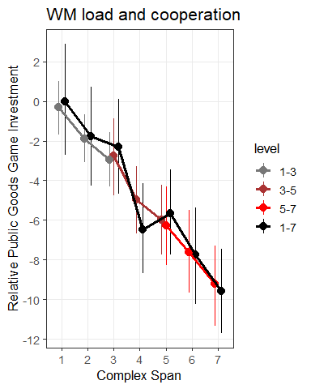
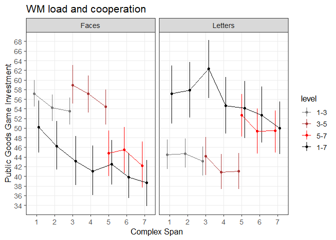
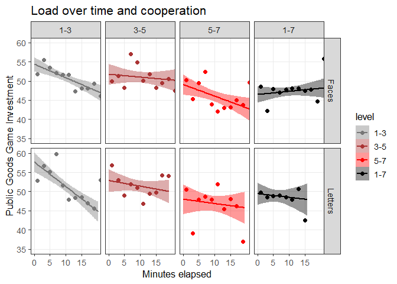

Morality in the time of cognitive famine - Public Goods Game
================
Jonas Kristoffer Lindeløv
December, 2018

  - [About](#about)
  - [Setting up](#setting-up)
  - [Load data](#load-data)
  - [Descriptives](#descriptives)
  - [Concurrent load: Figure 2](#concurrent-load-figure-2)
  - [Concurrent load: inference](#concurrent-load-inference)
  - [Figure 3: Effect of time](#figure-3-effect-of-time)
  - [Depletion on PGG investment:
    Inference](#depletion-on-pgg-investment-inference)
  - [Supplementary stuff](#supplementary-stuff)

<!--
# TO DO
* Number of trials per subject as a criterion?
-->

# About

This is part of the analysis that accompanies the paper “Morality in the
time of cognitive famine” by Panos, Jonas, Michaela, and others. You are
now looking at the analysis of **experiment 1** using the Public Goods
Game to study cooperation and Operation Span task to load working
memory.

# Setting up

Load appropriate stuff:

``` r
library(tidyverse)
library(lme4)
#library(kableExtra)

source('misc/functions utility.R')
source('misc/functions inference.R')  # Contains LRT and LRT_binom
```

You could redo the preprocessing of the original data if you wanted to.
It saves the .Rda files which are loaded in the sections below.

``` r
source('preprocess PGG.R')
```

# Load data

… and remove two subjects who did not follow instructions (noted by the
research assistant)

``` r
# Load the data.frame (not in csv because the matrix columns would be lost)
D = readRDS('data/pgg.Rda') %>%
  filter(condition == 'experiment') %>%  # Remove practice, etc.
  select(-encode, -equationCorrect, -equationScores, -equationRTs, -recallAns, -equationAnss)  # Tidyr doesn't like these matrix columns and we won't be using them
```

# Descriptives

For manuscript:

``` r
D_id = D[!duplicated(D$id), ]

# Per-group descriptives for paper
D %>%
  # One row per participant
  group_by(id) %>%
  slice(1) %>%
  
  # Per-experiment group
  group_by(exp) %>%
  summarise(
    n=n(),
    age_years = sprintf('%.1f (%.1f)', mean(age), sd(age)),
    males = sprintf('%i (%.1f %%)', sum(gender=='male'), 100*sum(gender=='male')/n())
  ) #%>%
```

    ## # A tibble: 2 x 4
    ##     exp     n age_years  males      
    ##   <dbl> <int> <chr>      <chr>      
    ## 1     1    81 23.4 (2.9) 40 (49.4 %)
    ## 2     2   159 24.2 (4.3) 72 (45.3 %)

``` r
  # kable() %>% 
  # kable_styling(bootstrap_options = "striped", full_width = F)
```

Supplementary per-group info stratified by level and stimType
descriptives:

``` r
x = D %>%  
  # One row per participant
  group_by(id) %>%
  slice(1) %>%
  
  # Per stimType-level combination
  group_by(stimType, level) %>%
  summarise(
    n=n(),
    males = sprintf('%i (%.1f %%)', sum(gender=='male'), 100*sum(gender=='male')/n()),
    age_years = sprintf('%.1f (%.1f)', mean(age), sd(age))
  )

y = D %>%  # All trials
  group_by(stimType, level) %>%
  summarise(
    arithmetic = sprintf('%.1f%%', mean(equationCorrectness)*100),
    recall = sprintf('%.1f%%', mean(recallProportion)*100)
  )

bind_cols(x, y[,3:4])# %>%
```

    ## # A tibble: 8 x 7
    ## # Groups:   stimType [2]
    ##   stimType level     n males       age_years  arithmetic recall
    ##   <fct>    <fct> <int> <chr>       <chr>      <chr>      <chr> 
    ## 1 Faces    1-3      38 18 (47.4 %) 24.3 (3.6) 90.0%      92.3% 
    ## 2 Faces    3-5      30 15 (50.0 %) 24.2 (3.1) 84.7%      82.6% 
    ## 3 Faces    5-7      33 15 (45.5 %) 23.6 (2.2) 89.8%      69.3% 
    ## 4 Faces    1-7      50 24 (48.0 %) 23.3 (2.5) 87.7%      81.8% 
    ## 5 Letters  1-3      20 5 (25.0 %)  24.2 (2.7) 88.8%      85.5% 
    ## 6 Letters  3-5      21 10 (47.6 %) 25.6 (9.3) 81.0%      89.0% 
    ## 7 Letters  5-7      17 9 (52.9 %)  23.2 (1.9) 89.0%      84.7% 
    ## 8 Letters  1-7      31 16 (51.6 %) 23.4 (3.4) 82.1%      83.3%

``` r
  # kable() %>% 
  # kable_styling(bootstrap_options = "striped", full_width = F)
```

# Concurrent load: Figure 2

``` r
# Fit a simple mixed model to show the results while subtracting individual differences
fit_full = lmer(pggInvest ~ span*stimType + (1|id), D)

# Add the fits to the data
x = ranef(fit_full)  # random effects for each subject
D$pggInvestOffset = mapvalues2(D$id, from=rownames(x$id), to=x$id$`(Intercept)`)  # map it unto data
df_tmp = filter(D, span==1 & level=='1-7')
y_offset = mean(df_tmp$pggInvest - df_tmp$pggInvestOffset, na.rm=T)
D$pggInvestZeroCenter = D$pggInvest - D$pggInvestOffset - y_offset

# Plot the figure
figure2 = ggplot(D, aes(x=span, y=pggInvestZeroCenter, color=level)) + 
  stat_summary(fun.data='mean_cl_boot', position=position_dodge(0.5), size=0.7) +
  stat_summary(fun.y=mean, geom="line", position=position_dodge(0.5), lwd=1.3) +
  #facet_grid(~stimType) +
  labs(title='WM load and cooperation', y='Relative Public Goods Game Investment', x='Complex Span') + 
  scale_x_continuous(breaks=1:7) + scale_y_continuous(breaks=seq(-100, 100, 2))

figure2 = style_my_plot(figure2)

# Show it and save it
ggsave('figures/Figure 2 - PGG and CS span.png', figure2, width=6, height=6, units='cm', dpi=300, scale=1.7)
figure2
```

<!-- -->

Supplementary figure:

``` r
figureS2 = ggplot(D, aes(x=span, y=pggInvest, color=level)) + 
  stat_summary(fun.data='mean_cl_boot', position=position_dodge(0.5), size=0.3) +
  stat_summary(fun.y=mean, geom="line", position=position_dodge(0.5)) +
  facet_grid(~stimType) +
  labs(title='WM load and cooperation', y='Public Goods Game Investment', x='Complex Span') + 
  scale_x_continuous(breaks=1:7) + scale_y_continuous(breaks=seq(-100, 100, 2))

figureS2 = style_my_plot(figureS2)

# Show it and save it
ggsave('figures/Figure S2 - PGG and CS span.png', figureS2, width=9, height=6, units='cm', dpi=300, scale=1.7)
figureS2
```

<!-- -->

# Concurrent load: inference

Main test. Output of `LRT` consists of:

1.  LRT test to obtain p-value
2.  Parameters from `lmer` of the full model
3.  Bootstrapped parameter estimates and intervals
4.  BIC-based Bayes Factor based on the BIC values from (1)

<!-- end list -->

``` r
LRT(D, 
    pggInvest ~ span + stimType + time_hours + (span|id), 
    pggInvest ~    1 + stimType + time_hours + (span|id))
```

    ## Data: D
    ## Models:
    ## fit.null: pggInvest ~ 1 + stimType + time_hours + (span | id)
    ## fit.full: pggInvest ~ span + stimType + time_hours + (span | id)
    ##          Df   AIC   BIC logLik deviance  Chisq Chi Df Pr(>Chisq)    
    ## fit.null  7 78719 78769 -39353    78705                             
    ## fit.full  8 78694 78750 -39339    78678 27.459      1  1.605e-07 ***
    ## ---
    ## Signif. codes:  0 '***' 0.001 '**' 0.01 '*' 0.05 '.' 0.1 ' ' 1
    ##                    Estimate Std. Error    t value
    ## (Intercept)      54.7360929  2.5260510 21.6686417
    ## span             -1.4923308  0.2758984 -5.4089872
    ## stimTypeLetters   0.9040891  3.6677542  0.2464967
    ## time_hours      -14.2504376  2.6164431 -5.4464924
    ##                                  2.5 %     97.5 %
    ## (Intercept)      54.7360929  49.785124 59.6870618
    ## span             -1.4923308  -2.033082 -0.9515799
    ## stimTypeLetters   0.9040891  -6.284577  8.0927552
    ## time_hours      -14.2504376 -19.378572 -9.1223033
    ## [1] "BIC-based Bayes Factor: 9897.4"

I would looove to go proper Bayesian, but it is too slow:

``` r
# # Bayesian version (takes a looooooong time to run!)
# # Needs well-considered priors
# library(brms)
# full = brm(pggInvest ~ span + stimType + time_hours + (span|id), D, chains=1, cores=1, iter=650, warmup=150, save_all_pars=TRUE)
# null = brm(pggInvest ~    1 + stimType + time_hours + (span|id), D, chains=1, cores=1, iter=650, warmup=150, save_all_pars=TRUE)
# bayes_factor(full, null)
# loo(full, null)


# # Disregard the many responses at 0 and 100 as being from a different process
# D$pggInvest_scaled = D$pggInvest / 100  # Scale down to [0, 1]; effectively making this equivalent to a stretched beta
# 
# Q = bf(
#   pggInvest_scaled ~ span + (1|id),
#   phi ~ span,
#   zoi ~ span,
#   coi ~ span,
#   family = zero_one_inflated_beta()
# )
# 
# Q_fit = brm(Q, D)
```

Effect of CS stimulus type - does it change (interact with) the slope?

``` r
LRT(D, 
    pggInvest ~ span * stimType + time_hours + (span|id), 
    pggInvest ~ span + stimType + time_hours + (span|id))
```

    ## Warning in checkConv(attr(opt, "derivs"), opt$par, ctrl =
    ## control$checkConv, : Model failed to converge with max|grad| = 0.00449378
    ## (tol = 0.002, component 1)

    ## Data: D
    ## Models:
    ## fit.null: pggInvest ~ span + stimType + time_hours + (span | id)
    ## fit.full: pggInvest ~ span * stimType + time_hours + (span | id)
    ##          Df   AIC   BIC logLik deviance  Chisq Chi Df Pr(>Chisq)
    ## fit.null  8 78694 78750 -39339    78678                         
    ## fit.full  9 78695 78759 -39339    78677 0.8079      1     0.3687
    ##                         Estimate Std. Error    t value
    ## (Intercept)           55.5956326  2.7015446 20.5792020
    ## span                  -1.6953185  0.3558821 -4.7637084
    ## stimTypeLetters       -1.2484452  4.3824391 -0.2848745
    ## time_hours           -14.2624145  2.6164197 -5.4511189
    ## span:stimTypeLetters   0.5059985  0.5622799  0.8999050
    ##                                        2.5 %     97.5 %
    ## (Intercept)           55.5956326  50.3007024 60.8905628
    ## span                  -1.6953185  -2.3928346 -0.9978024
    ## stimTypeLetters       -1.2484452  -9.8378680  7.3409776
    ## time_hours           -14.2624145 -19.3905028 -9.1343262
    ## span:stimTypeLetters   0.5059985  -0.5960499  1.6080469
    ## [1] "BIC-based Bayes Factor: 61.9*"

Effect of difficulty level - does it change (interact with) the slope?

``` r
LRT(D, 
    pggInvest ~ span * level + stimType + time_hours + (span|id),
    pggInvest ~ span + level + stimType + time_hours + (span|id))
```

    ## Warning in checkConv(attr(opt, "derivs"), opt$par, ctrl =
    ## control$checkConv, : Model failed to converge with max|grad| = 0.0131107
    ## (tol = 0.002, component 1)

    ## Data: D
    ## Models:
    ## fit.null: pggInvest ~ span + level + stimType + time_hours + (span | id)
    ## fit.full: pggInvest ~ span * level + stimType + time_hours + (span | id)
    ##          Df   AIC   BIC logLik deviance  Chisq Chi Df Pr(>Chisq)
    ## fit.null 11 78699 78777 -39339    78677                         
    ## fit.full 14 78705 78804 -39339    78677 0.1877      3     0.9796
    ##                    Estimate Std. Error    t value
    ## (Intercept)      53.6394110  4.2050081 12.7560779
    ## span             -1.2860481  0.5879584 -2.1873113
    ## level3-5          3.6946521  6.3497203  0.5818606
    ## level5-7          1.4161995  7.6368465  0.1854430
    ## level1-7          0.0845384  5.2932111  0.0159711
    ## stimTypeLetters   0.8266560  3.6690749  0.2253037
    ## time_hours      -14.2816674  2.6170508 -5.4571609
    ## span:level3-5    -0.2694583  0.9519306 -0.2830651
    ## span:level5-7    -0.1592111  1.0749421 -0.1481113
    ## span:level1-7    -0.2954593  0.6997137 -0.4222574
    ##                                  2.5 %     97.5 %
    ## (Intercept)      53.6394110  45.397747 61.8810754
    ## span             -1.2860481  -2.438425 -0.1336708
    ## level3-5          3.6946521  -8.750571 16.1398753
    ## level5-7          1.4161995 -13.551744 16.3841435
    ## level1-7          0.0845384 -10.289965 10.4590416
    ## stimTypeLetters   0.8266560  -6.364599  8.0179106
    ## time_hours      -14.2816674 -19.410993 -9.1523420
    ## span:level3-5    -0.2694583  -2.135208  1.5962914
    ## span:level5-7    -0.1592111  -2.266059  1.9476368
    ## span:level1-7    -0.2954593  -1.666873  1.0759544
    ## [1] "BIC-based Bayes Factor: 725454.7*"

# Figure 3: Effect of time

``` r
# Get subject random effects. Intercept t=0, but keep level-specific offsets
fit = lmer(pggInvest ~ time_secs + level + stimType + (1|id), D)
x = ranef(fit)

# map it unto data
D$pggInvestOffset = mapvalues2(D$id, from=rownames(x$id), to=x$id$`(Intercept)`)

# Plot linearly with data
figure3 = ggplot(D, aes(x=time_secs/60, y=pggInvest - pggInvestOffset, color=level, fill=level)) +  # plot data with subject-specific offsets
  stat_smooth(method='glm') +  # Make it linear
  stat_summary_bin(fun.y=mean, geom='point', binwidth=2, size=2) +
  facet_grid(stimType~level) + 
  
  # Styling
  labs(title='Load over time and cooperation', y='Public Goods Game Investment', x='Minutes elapsed') + 
  scale_x_continuous(breaks=seq(0, 18, 5)) + coord_cartesian(xlim=c(0, 20), ylim=c(35, 60)) + scale_y_continuous(breaks=seq(-100, 100, 5))

figure3 = style_my_plot(figure3)
figure3
```

<!-- -->

``` r
ggsave('figures/Figure 3 - PGG and CS over time.png', figure3, width=8, height=4.5, units='cm', dpi=300, scale=2.5)
```

# Depletion on PGG investment: Inference

Main analysis:

``` r
LRT(D, pggInvest ~ level * time_hours + stimType + (span|id),
       pggInvest ~ level + time_hours + stimType + (span|id))
```

    ## Warning in checkConv(attr(opt, "derivs"), opt$par, ctrl =
    ## control$checkConv, : Model failed to converge with max|grad| = 0.0022154
    ## (tol = 0.002, component 1)

    ## Data: D
    ## Models:
    ## fit.null: pggInvest ~ level + time_hours + stimType + (span | id)
    ## fit.full: pggInvest ~ level * time_hours + stimType + (span | id)
    ##          Df   AIC   BIC logLik deviance Chisq Chi Df Pr(>Chisq)    
    ## fit.null 10 78724 78795 -39352    78704                            
    ## fit.full 13 78704 78796 -39339    78678 26.31      3  8.213e-06 ***
    ## ---
    ## Signif. codes:  0 '***' 0.001 '**' 0.01 '*' 0.05 '.' 0.1 ' ' 1
    ##                        Estimate Std. Error    t value
    ## (Intercept)          49.9552782   3.856065 12.9549893
    ## level3-5              0.6303226   5.281219  0.1193517
    ## level5-7             -3.2501141   5.358142 -0.6065748
    ## level1-7             -2.9971303   4.740535 -0.6322347
    ## time_hours          -28.9234278   4.035228 -7.1677299
    ## stimTypeLetters       1.1873674   3.677469  0.3228763
    ## level3-5:time_hours  22.9996175   6.813312  3.3756883
    ## level5-7:time_hours  15.4157862   8.014337  1.9235260
    ## level1-7:time_hours  33.4083173   6.977951  4.7876975
    ##                                       2.5 %     97.5 %
    ## (Intercept)          49.9552782  42.3975301  57.513026
    ## level3-5              0.6303226  -9.7206759  10.981321
    ## level5-7             -3.2501141 -13.7518803   7.251652
    ## level1-7             -2.9971303 -12.2884073   6.294147
    ## time_hours          -28.9234278 -36.8323303 -21.014525
    ## stimTypeLetters       1.1873674  -6.0203393   8.395074
    ## level3-5:time_hours  22.9996175   9.6457716  36.353463
    ## level5-7:time_hours  15.4157862  -0.2920264  31.123599
    ## level1-7:time_hours  33.4083173  19.7317850  47.084850
    ## [1] "BIC-based Bayes Factor: 1.5*"

Without easy-letters:

``` r
LRT(filter(D, !(level == '1-3' & stimType=='Letters')), 
    pggInvest ~ level * time_hours + stimType + (span|id),
    pggInvest ~ level + time_hours + stimType + (span|id))
```

    ## Warning in checkConv(attr(opt, "derivs"), opt$par, ctrl =
    ## control$checkConv, : Model failed to converge with max|grad| = 0.00548566
    ## (tol = 0.002, component 1)

    ## Warning in checkConv(attr(opt, "derivs"), opt$par, ctrl =
    ## control$checkConv, : Model failed to converge with max|grad| = 0.00274035
    ## (tol = 0.002, component 1)

    ## Data: D
    ## Models:
    ## fit.null: pggInvest ~ level + time_hours + stimType + (span | id)
    ## fit.full: pggInvest ~ level * time_hours + stimType + (span | id)
    ##          Df   AIC   BIC logLik deviance  Chisq Chi Df Pr(>Chisq)   
    ## fit.null 10 64901 64970 -32440    64881                            
    ## fit.full 13 64894 64983 -32434    64868 12.675      3   0.005396 **
    ## ---
    ## Signif. codes:  0 '***' 0.001 '**' 0.01 '*' 0.05 '.' 0.1 ' ' 1
    ##                       Estimate Std. Error    t value
    ## (Intercept)          51.753809   4.559135 11.3516740
    ## level3-5             -2.172234   6.217792 -0.3493578
    ## level5-7             -5.792626   6.198640 -0.9344996
    ## level1-7             -5.930859   5.720186 -1.0368298
    ## time_hours          -21.471686   5.154725 -4.1654377
    ## stimTypeLetters       3.188210   4.219698  0.7555540
    ## level3-5:time_hours  15.575226   7.419979  2.0990931
    ## level5-7:time_hours   8.004157   8.479781  0.9439107
    ## level1-7:time_hours  26.098925   7.564887  3.4500088
    ##                                     2.5 %     97.5 %
    ## (Intercept)          51.753809  42.818070  60.689549
    ## level3-5             -2.172234 -14.358883  10.014415
    ## level5-7             -5.792626 -17.941736   6.356484
    ## level1-7             -5.930859 -17.142218   5.280499
    ## time_hours          -21.471686 -31.574761 -11.368611
    ## stimTypeLetters       3.188210  -5.082246  11.458665
    ## level3-5:time_hours  15.575226   1.032335  30.118117
    ## level5-7:time_hours   8.004157  -8.615909  24.624223
    ## level1-7:time_hours  26.098925  11.272020  40.925831
    ## [1] "BIC-based Bayes Factor: 1062.6*"

Only easy-letters

``` r
LRT(filter(D, (level == '1-3' & stimType=='Letters')), 
    pggInvest ~ time_hours + (span|id),
    pggInvest ~         1 + (span|id))
```

    ## Warning in checkConv(attr(opt, "derivs"), opt$par, ctrl =
    ## control$checkConv, : Model failed to converge with max|grad| = 0.00449861
    ## (tol = 0.002, component 1)

    ## Data: D
    ## Models:
    ## fit.null: pggInvest ~ 1 + (span | id)
    ## fit.full: pggInvest ~ time_hours + (span | id)
    ##          Df   AIC   BIC  logLik deviance  Chisq Chi Df Pr(>Chisq)    
    ## fit.null  5 13793 13819 -6891.3    13783                             
    ## fit.full  6 13763 13795 -6875.6    13751 31.429      1  2.069e-08 ***
    ## ---
    ## Signif. codes:  0 '***' 0.001 '**' 0.01 '*' 0.05 '.' 0.1 ' ' 1
    ##              Estimate Std. Error   t value
    ## (Intercept)  48.06531   5.281566  9.100579
    ## time_hours  -39.25452   6.964596 -5.636296
    ##                           2.5 %    97.5 %
    ## (Intercept)  48.06531  37.71363  58.41698
    ## time_hours  -39.25452 -52.90488 -25.60417
    ## [1] "BIC-based Bayes Factor: 173858.2"

# Supplementary stuff

See the notebook for the dots task for more supplementary analyses.
